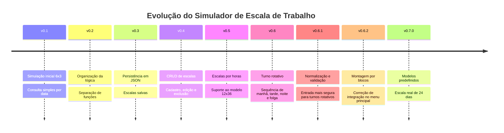
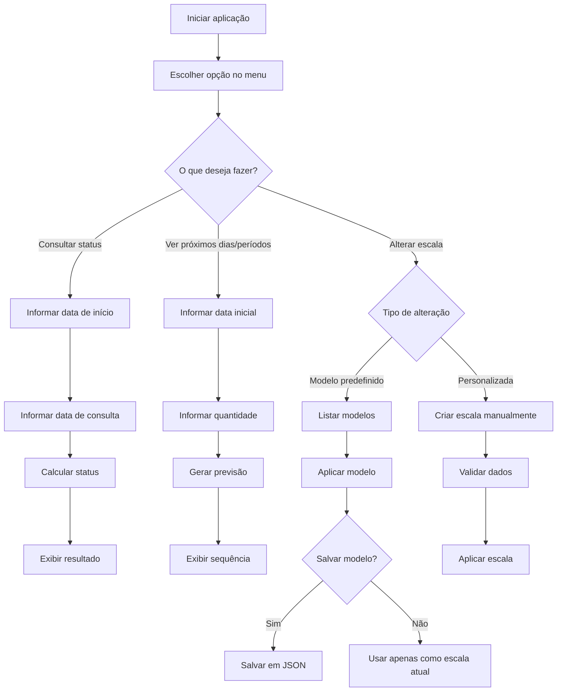
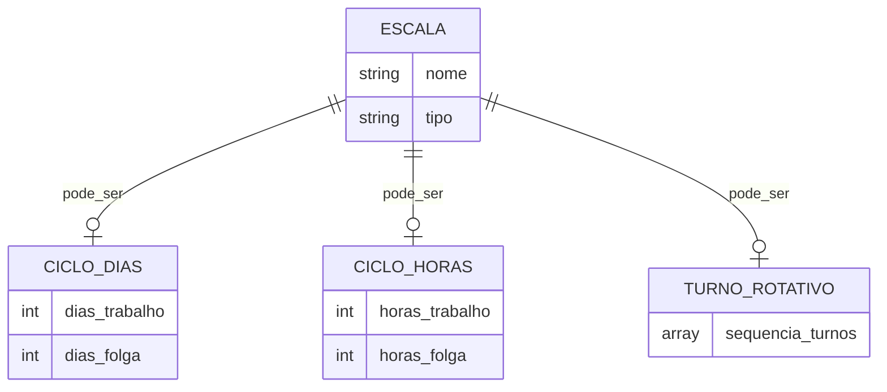
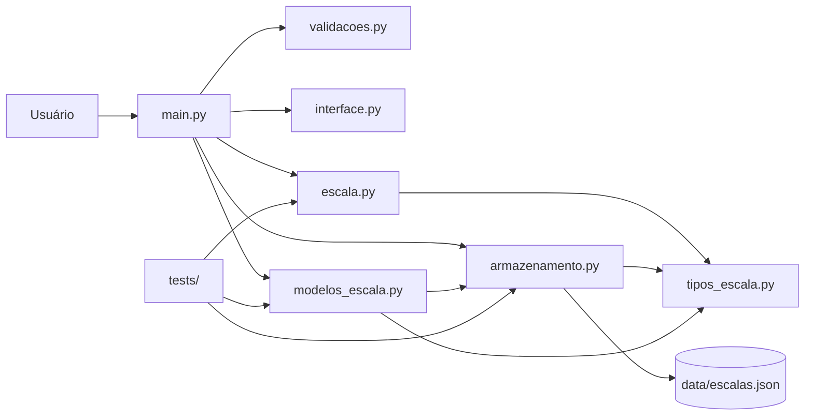
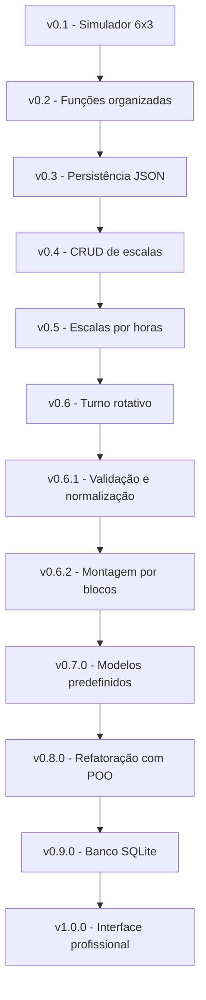

<p align="center">
  
</p>

<h1 align="center">⏰ Simulador de Escala de Trabalho</h1>

<p align="center">
  <strong>Aplicação em Python para consultar, simular, cadastrar, editar, reutilizar e excluir escalas de trabalho por dias, por horas e por turnos rotativos, com modelos predefinidos, escala real de 24 dias, persistência em JSON, testes automatizados e visão de evolução para produto.</strong>
</p>

<p align="center">
  
</p>

<p align="center">
  
  
  
  
  
  
  
  
</p>

<p align="center">
  <a href="https://dinox75.github.io/simulador-escala-trabalho/demo/" target="_blank">
    
  </a>
</p>

<p align="center">
  <a href="#-sobre-o-projeto">Sobre</a> •
  <a href="#-vers%C3%A3o-atual">Versão atual</a> •
  <a href="#-gr%C3%A1fico-de-evolu%C3%A7%C3%A3o">Evolução</a> •
  <a href="#-funcionalidades">Funcionalidades</a> •
  <a href="#-arquitetura-do-projeto">Arquitetura</a> •
  <a href="#-como-executar-o-projeto">Executar</a> •
  <a href="#-roadmap">Roadmap</a>
</p>

---

<table>
  <tr>
    <td width="25%" align="center">
      <h3>📆 Escalas por dias</h3>
      <p>Modelos como 6x3, 5x2 e 4x2.</p>
    </td>
    <td width="25%" align="center">
      <h3>⏱️ Escalas por horas</h3>
      <p>Suporte para ciclos como 12x36.</p>
    </td>
    <td width="25%" align="center">
      <h3>🔄 Turno rotativo</h3>
      <p>Sequências manuais, por blocos e modelos prontos.</p>
    </td>
    <td width="25%" align="center">
      <h3>🧪 Testes</h3>
      <p>Validação automatizada com pytest.</p>
    </td>
  </tr>
</table>

---

## 📌 Sobre o projeto

O **Simulador de Escala de Trabalho** é um projeto em Python criado para consultar, simular e gerenciar escalas de trabalho de forma simples, prática e evolutiva.

A aplicação começou como um simulador de escala `6x3`, mas foi crescendo de forma organizada até se tornar uma base com:

- suporte a escalas por dias;
- suporte a escalas por horas;
- suporte a turnos rotativos;
- modelos predefinidos de escala;
- escala real de 24 dias;
- cadastro, edição, exclusão e aplicação de escalas salvas;
- persistência em arquivo JSON;
- validações de entrada;
- testes automatizados;
- arquitetura modular;
- demo web interativa;
- visão de evolução para colaborador, empresa, banco de dados e aplicativo.

O foco do projeto é transformar uma necessidade comum de trabalhadores em uma solução simples de consultar, fácil de expandir e boa o suficiente para compor um portfólio técnico com evolução real.

---

## 🚀 Versão atual

> **v0.7.0 - Modelos predefinidos de escala**

A versão `v0.7.0` adiciona uma camada importante de praticidade: agora o usuário pode escolher **modelos prontos de escala**, sem precisar configurar tudo manualmente.

A aplicação passa a oferecer modelos como:

- `6x3`;
- `5x2`;
- `4x2`;
- `12x36`;
- turno rotativo simples;
- escala real de 24 dias.

Além disso, o usuário pode aplicar um modelo como escala atual e também salvá-lo nas escalas cadastradas.

### Principais entregas da v0.7.0

| Categoria | Entrega |
|---|---|
| 🧩 Modelos | Criação do arquivo `modelos_escala.py` |
| 📆 Ciclos por dias | Modelos prontos 6x3, 5x2 e 4x2 |
| ⏱️ Ciclo por horas | Modelo pronto 12x36 |
| 🔄 Turno rotativo | Modelo de turno rotativo simples |
| 🧭 Escala real | Modelo de escala real com ciclo de 24 dias |
| 🖥️ CLI | Integração dos modelos ao menu principal |
| 💾 Persistência | Opção de salvar modelo nas escalas salvas |
| 🧪 Testes | Testes para modelos e escala real de 24 dias |

> [!NOTE]
> A v0.7.0 não substitui as escalas personalizadas. Ela adiciona modelos prontos para acelerar o uso e preparar o projeto para evoluções maiores.

---

## 📊 Gráfico de evolução



---

## 🧭 Etapas de uso da aplicação



---

## 🧱 Schema atual dos dados

Atualmente, o projeto usa arquivo JSON para persistir as escalas salvas.

Arquivo principal:

```text
data/escalas.json
```

### Formato geral



### Exemplo de escala por dias

```json
{
  "nome": "Escala 6x3",
  "tipo": "ciclo_dias",
  "dias_trabalho": 6,
  "dias_folga": 3
}
```

### Exemplo de escala por horas

```json
{
  "nome": "Escala 12x36",
  "tipo": "ciclo_horas",
  "horas_trabalho": 12,
  "horas_folga": 36
}
```

### Exemplo de turno rotativo

```json
{
  "nome": "Minha escala real 24 dias",
  "tipo": "turno_rotativo",
  "sequencia_turnos": [
    "Tarde", "Tarde", "Tarde",
    "Noite", "Noite", "Noite",
    "Folga", "Folga", "Folga",
    "Tarde", "Tarde", "Tarde",
    "Noite", "Noite", "Noite",
    "Folga", "Folga",
    "Manhã", "Manhã", "Manhã", "Manhã", "Manhã", "Manhã",
    "Folga"
  ]
}
```

---

## 🌐 Demo interativa

O projeto possui uma demo web publicada no GitHub Pages:

```text
https://dinox75.github.io/simulador-escala-trabalho/demo/
```

A demo foi pensada para deixar o projeto mais apresentável para portfólio, LinkedIn e recrutadores.  
Ela ajuda a explicar a ideia do sistema, a dor que ele resolve e a visão de evolução para uso por colaboradores e empresas.

> [!IMPORTANT]
> A demo web funciona como vitrine visual. A implementação principal e mais completa ainda está na aplicação Python executada pelo terminal.

---

## 📌 Problema resolvido

Muitas pessoas trabalham em escalas que se repetem em ciclos. Nem sempre é fácil saber rapidamente se em determinada data a pessoa estará trabalhando, de folga ou em qual turno estará.

Em ambientes com escalas alternadas, isso pode gerar:

- confusão ao consultar datas futuras;
- erro no planejamento pessoal;
- dificuldade para visualizar folgas;
- dependência de planilhas, murais ou anotações;
- dificuldade para reutilizar escalas já conhecidas;
- dificuldade para editar ou remover escalas cadastradas incorretamente;
- dificuldade para lidar com diferentes modelos de escala em um mesmo sistema.

Este projeto nasceu a partir de uma necessidade real: transformar uma regra repetitiva em uma ferramenta prática, testável e expansível.

---

## ✅ Solução proposta

A solução é uma aplicação CLI em Python que permite:

- escolher uma escala atual;
- consultar uma data específica;
- visualizar próximos dias ou períodos;
- cadastrar escalas personalizadas;
- usar modelos predefinidos;
- salvar modelos como escalas cadastradas;
- editar escalas existentes;
- excluir escalas salvas;
- persistir dados em JSON;
- testar a lógica com segurança.

---

## 🎯 Funcionalidades

A versão atual permite:

- consultar se uma data será de trabalho ou folga;
- consultar turnos rotativos como `Manhã`, `Tarde`, `Noite` e `Folga`;
- visualizar próximos dias de uma escala por dias;
- visualizar próximos períodos de uma escala por horas;
- usar escala padrão `6x3`;
- usar escala administrativa `5x2`;
- usar escala `4x2`;
- usar escala `12x36`;
- usar turno rotativo simples;
- usar escala real de 24 dias;
- cadastrar escalas por dias;
- cadastrar escalas por horas;
- cadastrar escalas por turno rotativo;
- montar turnos rotativos manualmente;
- montar turnos rotativos por blocos;
- validar turnos permitidos;
- listar escalas salvas;
- aplicar uma escala salva como escala atual;
- aplicar um modelo predefinido como escala atual;
- salvar modelo predefinido nas escalas salvas;
- editar escalas salvas por dias;
- editar escalas salvas por horas;
- editar escalas salvas por turno rotativo;
- excluir escalas salvas;
- confirmar ações sensíveis;
- evitar nomes duplicados;
- evitar configurações duplicadas;
- bloquear sequência de turnos vazia;
- bloquear turnos inválidos;
- persistir dados em JSON;
- normalizar escalas antigas sem campo `tipo`;
- testar a lógica com testes automatizados.

---

## 🧩 Modelos predefinidos

A partir da `v0.7.0`, o projeto passa a ter modelos prontos centralizados no arquivo:

```text
modelos_escala.py
```

### Modelos disponíveis

| Modelo | Tipo | Descrição |
|---|---|---|
| Escala 6x3 | Ciclo por dias | 6 dias de trabalho e 3 dias de folga |
| Escala 5x2 | Ciclo por dias | 5 dias de trabalho e 2 dias de folga |
| Escala 4x2 | Ciclo por dias | 4 dias de trabalho e 2 dias de folga |
| Escala 12x36 | Ciclo por horas | 12 horas de trabalho e 36 horas de folga |
| Turno rotativo simples | Turno rotativo | Manhã x2, Tarde x2, Noite x2, Folga x2 |
| Minha escala real 24 dias | Turno rotativo | Ciclo real com tarde, noite, folga e manhã |

### Escala real de 24 dias

A escala real implementada na v0.7.0 segue este ciclo:

```text
Tarde x3
Noite x3
Folga x3
Tarde x3
Noite x3
Folga x2
Manhã x6
Folga x1
```

Resultado final:

```text
Tarde -> Tarde -> Tarde -> Noite -> Noite -> Noite -> Folga -> Folga -> Folga ->
Tarde -> Tarde -> Tarde -> Noite -> Noite -> Noite -> Folga -> Folga ->
Manhã -> Manhã -> Manhã -> Manhã -> Manhã -> Manhã -> Folga
```

Resumo do ciclo:

| Turno | Quantidade |
|---|---:|
| Tarde | 6 dias |
| Noite | 6 dias |
| Manhã | 6 dias |
| Folga | 6 dias |
| **Total** | **24 dias** |

---

## 🧠 Como a lógica funciona

### 🔁 Escalas por dias

Para escalas por dias, o sistema calcula quantos dias se passaram desde a data inicial.

Depois aplica o operador módulo (`%`) para descobrir a posição dentro do ciclo.

Exemplo `6x3`:

```text
6 dias de trabalho + 3 dias de folga = ciclo de 9 dias
```

Se a posição estiver dentro dos 6 primeiros dias, o status é:

```text
Trabalhando
```

Caso contrário:

```text
Folga
```

---

### ⏱️ Escalas por horas

Para escalas por horas, o sistema trabalha com `datetime`.

Exemplo `12x36`:

```text
12 horas de trabalho + 36 horas de folga = ciclo de 48 horas
```

A aplicação calcula quantas horas se passaram desde o início da escala e identifica a posição dentro do ciclo de horas.

---

### 🔄 Turno rotativo

No turno rotativo, o sistema usa uma lista de turnos.

Exemplo:

```python
[
    "Manhã",
    "Manhã",
    "Tarde",
    "Tarde",
    "Noite",
    "Noite",
    "Folga",
    "Folga"
]
```

A data consultada é convertida em uma posição dentro dessa sequência.  
Quando o ciclo chega ao fim, ele recomeça automaticamente.

---

### 🧱 Montagem por blocos

A montagem por blocos evita que o usuário precise digitar uma sequência longa manualmente.

Em vez de digitar:

```text
Tarde, Tarde, Tarde, Noite, Noite, Noite, Folga, Folga, Folga
```

O usuário pode informar:

```text
Turno: Tarde
Quantidade de dias: 3

Turno: Noite
Quantidade de dias: 3

Turno: Folga
Quantidade de dias: 3
```

O sistema monta automaticamente:

```text
Tarde -> Tarde -> Tarde -> Noite -> Noite -> Noite -> Folga -> Folga -> Folga
```

---

## 🖥️ Menu principal da CLI

```text
==== SIMULADOR DE ESCALAS ====

Escala atual: 6x3 dias

1 - Consultar status
2 - Ver próximos dias/períodos
3 - Alterar escala
4 - Usar escala salva
5 - Cadastrar nova escala
6 - Editar escala salva
7 - Excluir escala salva
8 - Sair
```

Ao alterar a escala atual, o usuário pode escolher:

```text
Como deseja alterar a escala?
1 - Usar modelo predefinido
2 - Criar escala personalizada
```

Ao escolher modelos predefinidos:

```text
==== MODELOS DE ESCALA ====
1 - Escala 6x3
2 - Escala 5x2
3 - Escala 4x2
4 - Escala 12x36
5 - Turno rotativo simples
6 - Minha escala real 24 dias
```

---

## 💾 Exemplo de escalas salvas

O arquivo `data/escalas.json` pode conter escalas como:

```json
[
  {
    "nome": "Escala 6x3",
    "dias_trabalho": 6,
    "dias_folga": 3,
    "tipo": "ciclo_dias"
  },
  {
    "nome": "Escala Administrativa 5x2",
    "dias_trabalho": 5,
    "dias_folga": 2,
    "tipo": "ciclo_dias"
  },
  {
    "nome": "Escala 12x36",
    "tipo": "ciclo_horas",
    "horas_trabalho": 12,
    "horas_folga": 36
  },
  {
    "nome": "Minha escala real 24 dias",
    "tipo": "turno_rotativo",
    "sequencia_turnos": [
      "Tarde", "Tarde", "Tarde",
      "Noite", "Noite", "Noite",
      "Folga", "Folga", "Folga",
      "Tarde", "Tarde", "Tarde",
      "Noite", "Noite", "Noite",
      "Folga", "Folga",
      "Manhã", "Manhã", "Manhã", "Manhã", "Manhã", "Manhã",
      "Folga"
    ]
  }
]
```

---

## 🧱 Arquitetura do projeto



Estrutura principal:

```text
simulador-escala-trabalho/
│
├── main.py
├── escala.py
├── armazenamento.py
├── modelos_escala.py
├── tipos_escala.py
├── validacoes.py
├── interface.py
│
├── data/
│   └── escalas.json
│
├── tests/
│   ├── test_escala.py
│   ├── test_armazenamento.py
│   ├── test_modelos_escala.py
│   └── test_tipos_escalas.py
│
├── demo/
│   ├── index.html
│   ├── style.css
│   └── script.js
│
├── assets/
│   └── banner.png
│
├── README.md
├── CHANGELOG.md
├── requirements.txt
└── pytest.ini
```

---

## 🧩 Responsabilidades dos arquivos

| Arquivo | Responsabilidade |
|---|---|
| `main.py` | Controla o fluxo principal da aplicação e o menu da CLI |
| `escala.py` | Concentra os cálculos de escala por dias, horas e turno rotativo |
| `armazenamento.py` | Gerencia salvar, carregar, editar e remover escalas no JSON |
| `modelos_escala.py` | Centraliza os modelos predefinidos de escala |
| `tipos_escala.py` | Define constantes e nomes amigáveis dos tipos de escala |
| `validacoes.py` | Valida entradas do usuário |
| `interface.py` | Centraliza funções de exibição e formatação |
| `data/escalas.json` | Armazena as escalas salvas |
| `tests/` | Contém os testes automatizados |
| `demo/` | Contém a versão visual demonstrativa do projeto |

---

## 🧪 Testes automatizados

O projeto utiliza `pytest` para validar as principais regras.

Os testes cobrem:

- cálculo de escala por dias;
- cálculo de escala por horas;
- cálculo de turno rotativo;
- geração de próximos dias;
- geração de próximos períodos;
- cadastro de escalas;
- edição de escalas;
- exclusão de escalas;
- normalização de tipos antigos;
- normalização de nomes de turnos;
- bloqueio de turnos inválidos;
- montagem de sequência por blocos;
- modelos predefinidos;
- escala real de 24 dias.

Para rodar os testes:

```bash
pytest
```

Rodar apenas testes dos modelos:

```bash
pytest tests/test_modelos_escala.py
```

---

## ▶️ Como executar o projeto

### 1. Clonar o repositório

```bash
git clone https://github.com/Dinox75/simulador-escala-trabalho.git
```

### 2. Entrar na pasta

```bash
cd simulador-escala-trabalho
```

### 3. Criar ambiente virtual

```bash
python -m venv venv
```

### 4. Ativar ambiente virtual

Windows:

```bash
venv\Scripts\activate
```

Linux/Mac:

```bash
source venv/bin/activate
```

### 5. Instalar dependências

```bash
pip install -r requirements.txt
```

### 6. Executar aplicação

```bash
python main.py
```

### 7. Executar testes

```bash
pytest
```

---

## 🧭 Linha de evolução técnica



---

## 🏢 Visão de produto

O projeto pode evoluir para uma solução maior, com dois públicos principais.

### 👤 Área do colaborador

Funcionalidades possíveis:

- consultar escala pessoal;
- visualizar calendário mensal;
- receber aviso de folga;
- salvar escala favorita;
- consultar próximos turnos;
- exportar agenda;
- visualizar histórico de trabalho.

### 🏭 Área da empresa

Funcionalidades possíveis:

- cadastrar colaboradores;
- criar escalas por setor;
- aplicar escala a grupos;
- visualizar cobertura por dia;
- identificar falta de equipe em determinado turno;
- gerar relatórios;
- integrar com RH ou ponto eletrônico.

---

## 🗺️ Roadmap

### Próximas melhorias técnicas

- [ ] Refatorar o projeto com orientação a objetos;
- [ ] Criar classes como `Escala`, `EscalaPorDias`, `EscalaPorHoras` e `TurnoRotativo`;
- [ ] Substituir JSON por SQLite;
- [ ] Criar camada de serviço mais clara;
- [ ] Melhorar testes da CLI;
- [ ] Adicionar cobertura de testes;
- [ ] Criar arquivo de configuração para modelos padrão;
- [ ] Preparar estrutura para API.

### Próximas melhorias de produto

- [ ] Criar calendário visual;
- [ ] Criar interface web funcional;
- [ ] Permitir cadastro de colaboradores;
- [ ] Criar área da empresa;
- [ ] Criar área do colaborador;
- [ ] Permitir exportação de escala;
- [ ] Gerar relatórios de folgas e turnos;
- [ ] Criar sistema de alertas.

---

## 🧠 Aprendizados aplicados

Durante o desenvolvimento deste projeto foram aplicados conceitos como:

- funções em Python;
- validação de entrada;
- manipulação de datas com `datetime`;
- cálculo com operador módulo (`%`);
- estruturas condicionais;
- listas e dicionários;
- persistência em JSON;
- separação de responsabilidades;
- arquitetura modular;
- testes automatizados com `pytest`;
- versionamento com Git;
- organização por branches;
- uso de Pull Requests;
- documentação técnica;
- evolução incremental de software.

---

## 📚 Tecnologias usadas

| Tecnologia | Uso |
|---|---|
| Python | Linguagem principal |
| JSON | Persistência das escalas |
| Pytest | Testes automatizados |
| Git | Controle de versão |
| GitHub | Repositório, branches, PRs e releases |
| HTML/CSS/JS | Demo web visual |
| Mermaid | Diagramas e fluxos no README |

---

## 📷 Demonstração visual

A demo web ajuda a apresentar o projeto de forma mais visual.

```text
https://dinox75.github.io/simulador-escala-trabalho/demo/
```

> A versão CLI continua sendo a implementação principal neste momento.

---

## ⚠️ Limitações atuais

Apesar da evolução, o projeto ainda possui limitações importantes:

- ainda não possui banco de dados;
- ainda não possui interface web funcional completa;
- ainda não possui login ou cadastro de usuários;
- ainda não possui calendário visual completo;
- ainda não possui notificações;
- ainda não possui exportação de agenda;
- ainda não possui arquitetura orientada a objetos;
- a demo web ainda é uma vitrine visual, não a aplicação completa.

Essas limitações fazem parte do roadmap e ajudam a direcionar as próximas versões.

---

## ✅ Status da v0.7.0

| Item | Status |
|---|---|
| Modelos predefinidos | ✅ Implementado |
| Arquivo `modelos_escala.py` | ✅ Implementado |
| Modelo 6x3 | ✅ Implementado |
| Modelo 5x2 | ✅ Implementado |
| Modelo 4x2 | ✅ Implementado |
| Modelo 12x36 | ✅ Implementado |
| Modelo turno rotativo simples | ✅ Implementado |
| Modelo escala real 24 dias | ✅ Implementado |
| Integração ao menu principal | ✅ Implementado |
| Salvar modelo nas escalas salvas | ✅ Implementado |
| Testes dos modelos | ✅ Implementado |
| README atualizado | ✅ Implementado |
| CHANGELOG atualizado | ✅ Implementado |

---

## 📄 Licença

Este projeto está disponível para fins de estudo, prática e portfólio.

---

## 👨‍💻 Autor

Desenvolvido por **Vinicius Lima**.

- GitHub: [Dinox75](https://github.com/Dinox75)
- LinkedIn: [vinicius-limajr](https://www.linkedin.com/in/vinicius-limajr/)

---

<p align="center">
  <strong>Projeto em evolução contínua.</strong><br>
  De uma necessidade real para uma solução prática, testável e expansível.
</p>
