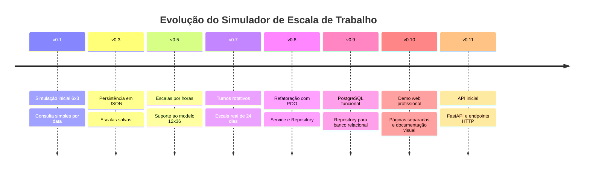
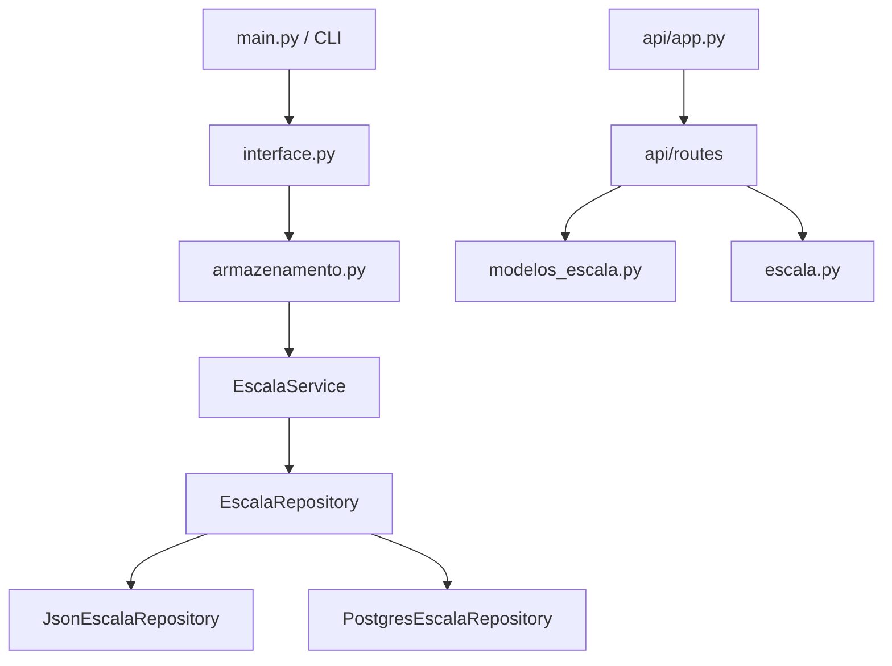
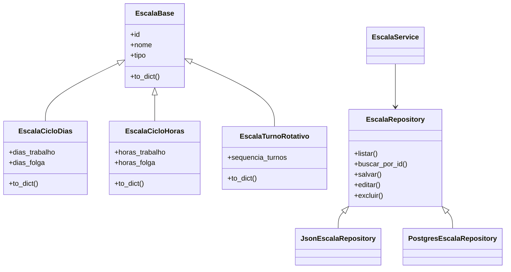
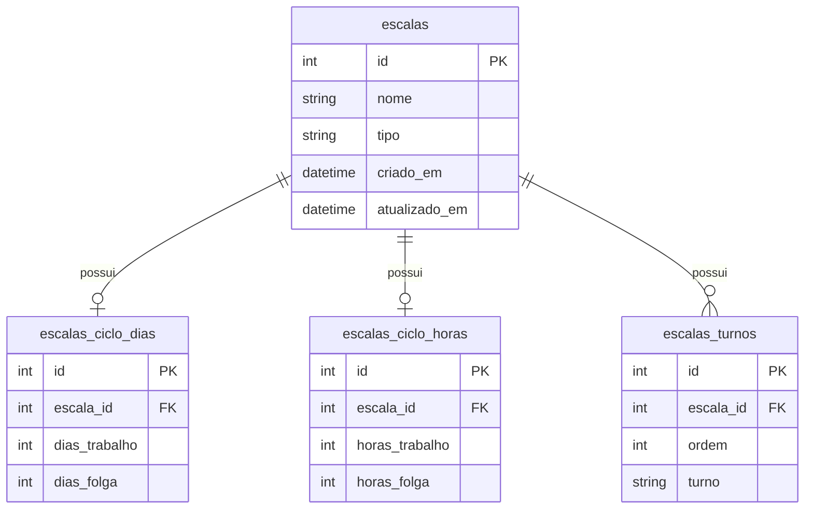

<p align="center">
  
</p>

<h1 align="center">⏰ Simulador de Escala de Trabalho</h1>

<p align="center">
  <strong>Aplicação em Python para consultar, simular, cadastrar, editar e excluir escalas de trabalho por dias, por horas e por turnos rotativos, com CLI, API inicial em FastAPI, persistência em JSON/PostgreSQL, testes automatizados e arquitetura em camadas.</strong>
</p>

<p align="center">
  
</p>

<p align="center">
  
  
  
  
  
  
  
  
  
</p>

<p align="center">
  <a href="https://dinox75.github.io/simulador-escala-trabalho/demo/" target="_blank">
    
  </a>
</p>

<p align="center">
  <a href="#-sobre-o-projeto">Sobre</a> •
  <a href="#-versão-atual">Versão atual</a> •
  <a href="#-funcionalidades">Funcionalidades</a> •
  <a href="#-api-inicial-v0110">API</a> •
  <a href="#-arquitetura">Arquitetura</a> •
  <a href="#-persistência-json-e-postgresql">Persistência</a> •
  <a href="#-testes-automatizados">Testes</a> •
  <a href="#-como-executar-o-projeto">Executar</a> •
  <a href="#-roadmap">Roadmap</a>
</p>

---

<table>
  <tr>
    <td width="25%" align="center">
      <h3>📆 Escalas por dias</h3>
      <p>Modelos como 6x3, 5x2 e 4x2.</p>
    </td>
    <td width="25%" align="center">
      <h3>⏱️ Escalas por horas</h3>
      <p>Suporte para ciclos como 12x36.</p>
    </td>
    <td width="25%" align="center">
      <h3>🔄 Turno rotativo</h3>
      <p>Sequências manuais, por blocos e modelos prontos.</p>
    </td>
    <td width="25%" align="center">
      <h3>⚡ API inicial</h3>
      <p>Endpoints HTTP com FastAPI na v0.11.0.</p>
    </td>
  </tr>
</table>

---

## 📌 Sobre o projeto

O **Simulador de Escala de Trabalho** é uma aplicação criada para consultar, simular e organizar escalas de trabalho de forma simples, prática e evolutiva.

O projeto nasceu a partir de uma dúvida real:

> **“Hoje eu trabalho, folgo ou estou em qual turno?”**

A aplicação começou como um simulador de escala `6x3` no terminal, mas evoluiu para uma base mais completa, com suporte a:

- escalas por dias;
- escalas por horas;
- turnos rotativos;
- montagem de turnos por blocos;
- modelos predefinidos;
- escala real de 24 dias;
- cadastro, edição, exclusão e aplicação de escalas salvas;
- persistência em arquivo JSON;
- persistência alternativa em PostgreSQL;
- arquitetura com Programação Orientada a Objetos;
- camada de service;
- camada de repository;
- API inicial com FastAPI;
- testes automatizados;
- demo web interativa para apresentação do projeto.

O foco do projeto é transformar uma necessidade comum de consulta de escala em uma solução técnica organizada, testável e com potencial de evolução para produto.

---

## 🚀 Versão atual

**Versão:** `v0.11.0 - API inicial`

A `v0.11.0` adiciona a primeira camada HTTP do projeto usando **FastAPI**.

Até a versão anterior, o projeto já possuía CLI, demo web, persistência em JSON/PostgreSQL, testes e arquitetura em camadas. Nesta versão, parte das funcionalidades do simulador passou a ser exposta por endpoints HTTP, preparando o caminho para uma futura integração com frontend, usuários, login e painel web.

### Resumo da v0.11.0

| Área | Evolução |
|---|---|
| API | Estrutura inicial com FastAPI |
| Health check | Endpoint para verificar se a API está ativa |
| Modelos | Endpoint para listar modelos disponíveis |
| Simulação | Endpoint para consultar status de uma escala |
| Próximos dias | Endpoint para retornar sequência de dias calculados |
| Documentação | Arquivo `docs/API.md` e exemplos em `docs/api_requests.http` |
| Testes | Testes automatizados para os endpoints da API |
| Validação manual | Testes realizados com Thunder Client |

---

## ✅ Principais entregas da v0.11.0

| Categoria | Entrega |
|---|---|
| API | Criação da estrutura `api/` |
| FastAPI | Aplicação configurada em `api/app.py` |
| Rotas | Separação de rotas em `api/routes/` |
| Health | `GET /health` |
| Modelos | `GET /api/v1/modelos` |
| Status | `POST /api/v1/simulacao/status` |
| Próximos dias | `POST /api/v1/simulacao/proximos-dias` |
| Documentação | `docs/API.md` |
| Requisições manuais | `docs/api_requests.http` |
| Testes | Testes automatizados com `pytest` |

---

## 📊 Linha de evolução



---

## 📌 Problema resolvido

Trabalhadores em escala frequentemente precisam consultar se determinado dia será de trabalho, folga ou qual turno será executado.

Esse problema fica mais evidente em escalas como:

- `6x3`;
- `5x2`;
- `4x2`;
- `12x36`;
- turnos rotativos;
- escalas com mudanças entre manhã, tarde, noite e folga.

A consulta manual em papel, planilhas ou memória pode gerar confusão, principalmente quando existem ciclos longos, virada de mês ou troca de turno.

---

## ✅ Solução proposta

O projeto permite informar uma escala, uma data inicial e uma data de consulta para descobrir automaticamente o status daquele dia.

A solução foi evoluindo em camadas:

1. **CLI em Python** para uso direto no terminal.
2. **Modelos predefinidos** para facilitar simulações comuns.
3. **Persistência em JSON** para salvar escalas.
4. **Arquitetura com POO, Service e Repository** para organizar o código.
5. **PostgreSQL funcional** como alternativa de persistência.
6. **Demo web** para apresentação visual do projeto.
7. **API inicial com FastAPI** para expor funcionalidades via HTTP.

---

## 🎯 Funcionalidades

### Consulta de status

Permite consultar se uma pessoa estará trabalhando, folgando ou em determinado turno em uma data informada.

Exemplo:

```text
Data inicial: 01/07/2026
Data consultada: 07/07/2026
Escala: 6x3
Resultado: Folga
```

### Visualização de próximos dias ou períodos

Permite visualizar uma sequência futura da escala, facilitando o planejamento pessoal.

### Cadastro de escalas

Permite cadastrar escalas personalizadas para reutilização posterior.

### Edição de escalas

Permite alterar escalas salvas.

### Exclusão de escalas

Permite remover escalas que não serão mais utilizadas.

### Modelos predefinidos

Inclui modelos prontos para facilitar testes e uso inicial.

### Persistência

O projeto suporta:

- JSON como persistência padrão;
- PostgreSQL como persistência alternativa configurável.

### API inicial

A partir da `v0.11.0`, o projeto passa a expor funcionalidades por endpoints HTTP usando FastAPI.

---

## 🧩 Modelos predefinidos

### Modelos disponíveis

| Modelo | Tipo | Descrição |
|---|---|---|
| `6x3` | ciclo por dias | 6 dias de trabalho e 3 dias de folga |
| `5x2` | ciclo por dias | 5 dias de trabalho e 2 dias de folga |
| `4x2` | ciclo por dias | 4 dias de trabalho e 2 dias de folga |
| `12x36` | ciclo por horas | 12 horas de trabalho e 36 horas de folga |
| `turno_rotativo_simples` | turno rotativo | sequência rotativa definida manualmente |
| `escala_real_24_dias` | turno rotativo | modelo de escala real com sequência de 24 dias |

### Escala real de 24 dias

O projeto também inclui uma escala rotativa baseada em uma sequência real de turnos, usada para validar cenários mais próximos da rotina de trabalho.

---

## 🧠 Como a lógica funciona

### 🔁 Escalas por dias

A regra considera a diferença entre a data inicial e a data consultada.

```python
ciclo = dias_trabalho + dias_folga
posicao = dias_passados % ciclo
```

Se a posição dentro do ciclo estiver dentro dos dias de trabalho, o status será `Trabalhando`. Caso contrário, será `Folga`.

### ⏱️ Escalas por horas

Para escalas como `12x36`, o cálculo considera data e hora.

```python
ciclo = horas_trabalho + horas_folga
posicao = horas_passadas % ciclo
```

Se a posição estiver dentro das horas de trabalho, o status será `Trabalhando`. Caso contrário, será `Folga`.

### 🔄 Turno rotativo

Para turnos rotativos, o sistema percorre uma sequência de turnos.

Exemplo:

```text
Manhã → Manhã → Tarde → Tarde → Noite → Noite → Folga → Folga
```

A posição dentro da sequência define o turno retornado.

### 🧱 Montagem por blocos

O projeto também suporta montagem de turnos por blocos, reduzindo repetição na criação de sequências maiores.

---

## 🖥️ Menu principal da CLI

Exemplo da interface principal no terminal:

```text
==== SIMULADOR DE ESCALAS ====
Escala atual: 6x3 dias

1 - Consultar status
2 - Ver próximos dias/períodos
3 - Alterar escala
4 - Ver escalas salvas
5 - Cadastrar nova escala
6 - Editar escala salva
7 - Excluir escala salva
8 - Sair

Escolha uma opção:
```

---

## ⚡ API inicial v0.11.0

## Versão atual

```text
v0.12.0 - API com CRUD de escalas salvas
```

A versão `v0.12.0` adiciona um CRUD completo de escalas salvas pela API, permitindo listar, criar, buscar, editar e excluir escalas por meio de endpoints HTTP.

Essa evolução transforma a API em uma camada mais completa do projeto, reaproveitando a lógica existente de serviços e repositories.

---

## API

A API foi desenvolvida com **FastAPI** e permite consumir funcionalidades do simulador por meio de requisições HTTP.

### Executar a API localmente

```powershell
uvicorn api.app:app --reload
```

Depois acesse:

```text
http://127.0.0.1:8000/docs
```

### Endpoints principais

| Método   | Endpoint                          | Descrição                                   |
| -------- | --------------------------------- | ------------------------------------------- |
| `GET`    | `/health`                         | Verifica se a API está funcionando          |
| `GET`    | `/api/v1/modelos`                 | Lista modelos de escala disponíveis         |
| `POST`   | `/api/v1/simulacao/status`        | Consulta o status de uma escala em uma data |
| `POST`   | `/api/v1/simulacao/proximos-dias` | Retorna próximos dias da escala             |
| `GET`    | `/api/v1/escalas`                 | Lista escalas salvas                        |
| `POST`   | `/api/v1/escalas`                 | Cria uma nova escala salva                  |
| `GET`    | `/api/v1/escalas/{nome}`          | Busca uma escala salva pelo nome            |
| `PUT`    | `/api/v1/escalas/{nome}`          | Edita uma escala salva pelo nome            |
| `DELETE` | `/api/v1/escalas/{nome}`          | Exclui uma escala salva pelo nome           |

---

## Evolução recente

### v0.12.0

* CRUD completo de escalas salvas pela API.
* Reaproveitamento da camada de serviço.
* Reaproveitamento da camada de repository.
* Testes automatizados para os novos endpoints.
* Documentação atualizada da API.
* Exemplos manuais em `docs/api_requests.http`.

### v0.11.0

* API inicial com FastAPI.
* Endpoints de health check, modelos, status e próximos dias.

### v0.10.0

* Demo web profissional separada em páginas.

### v0.9.0

* Suporte funcional a PostgreSQL.

---

## 🧱 Arquitetura

O projeto evoluiu para uma estrutura em camadas, separando responsabilidades e facilitando manutenção.



### Ideia principal

- A CLI continua funcionando como interface principal de terminal.
- A API adiciona uma nova forma de consumir parte das funcionalidades.
- A lógica de escala permanece separada da camada HTTP.
- A persistência continua desacoplada por repositories.

---

## 🧩 Arquitetura em camadas

| Camada | Responsabilidade |
|---|---|
| CLI | Interação com o usuário pelo terminal |
| API | Exposição de funcionalidades via HTTP |
| Models | Representação das escalas como objetos |
| Service | Regras de negócio relacionadas às escalas salvas |
| Repository | Contrato para persistência |
| JSON Repository | Persistência em arquivo JSON |
| PostgreSQL Repository | Persistência em banco relacional |
| Database | Conexão e schema PostgreSQL |
| Tests | Garantia de comportamento esperado |

---

## 🏛️ Diagrama das classes POO



---

## 🧱 Estrutura atual do projeto

```text
simulador-escala-trabalho/
├── .github/
│   └── workflows/
│       └── tests.yml
│
├── api/
│   ├── __init__.py
│   ├── app.py
│   └── routes/
│       ├── __init__.py
│       ├── health.py
│       ├── modelos.py
│       └── simulacao.py
│
├── assets/
│   └── banner.png
│
├── config/
│   ├── __init__.py
│   └── database_config.py
│
├── data/
│   └── escalas.json
│
├── database/
│   ├── inicializar_postgres.py
│   ├── postgres_connection.py
│   └── schema_postgresql.sql
│
├── docs/
│   ├── API.md
│   ├── api_requests.http
│   └── demo/
│       ├── index.html
│       ├── simulador.html
│       ├── documentacao.html
│       ├── sobre.html
│       ├── termos.html
│       ├── script.js
│       └── style.css
│
├── models/
│   ├── __init__.py
│   ├── escala_base.py
│   ├── escala_ciclo_dias.py
│   ├── escala_ciclo_horas.py
│   ├── escala_factory.py
│   └── escala_turno_rotativo.py
│
├── repositories/
│   ├── escala_repository.py
│   ├── json_escala_repository.py
│   └── postgres_escala_repository.py
│
├── services/
│   ├── escala_service.py
│   └── escala_service_factory.py
│
├── tests/
│   ├── test_api_health.py
│   ├── test_api_modelos.py
│   ├── test_api_simulacao.py
│   ├── test_api_proximos_dias.py
│   ├── test_postgres_escala_repository.py
│   └── demais testes do projeto
│
├── armazenamento.py
├── escala.py
├── interface.py
├── main.py
├── modelos_escala.py
├── tipos_escala.py
├── validacoes.py
├── requirements.txt
└── README.md
```

---

## 💾 Persistência JSON e PostgreSQL

O projeto possui duas formas de persistência:

| Tipo | Status | Uso |
|---|---|---|
| JSON | Padrão | Execução simples, testes e fallback |
| PostgreSQL | Funcional | Persistência relacional configurável |

### JSON

O JSON continua sendo o padrão do projeto.

Isso permite executar o sistema sem precisar configurar banco de dados.

```powershell
python main.py
```

### PostgreSQL

O PostgreSQL pode ser usado configurando variáveis de ambiente.

```powershell
$env:ESCALA_REPOSITORY="postgres"
```

A aplicação utiliza o repository correspondente de acordo com a configuração técnica definida.

---

## 🐘 Schema PostgreSQL

O schema atual usa uma tabela principal e tabelas específicas por tipo de escala.

### Tabelas principais

| Tabela | Responsabilidade |
|---|---|
| `escalas` | Guarda dados comuns da escala |
| `escalas_ciclo_dias` | Guarda dados de escalas por dias |
| `escalas_ciclo_horas` | Guarda dados de escalas por horas |
| `escalas_turnos` | Guarda a sequência dos turnos rotativos |

### Visão geral



---

## 🌐 Demo interativa

A demo web está disponível em:

```text
https://dinox75.github.io/simulador-escala-trabalho/demo/
```

A demo possui páginas separadas para:

- início;
- simulador;
- documentação;
- sobre;
- termos.

> Observação: a demo web atual é uma apresentação interativa do projeto e ainda não está conectada diretamente à API FastAPI.

---

## 🧪 Testes automatizados

O projeto possui testes automatizados com `pytest` cobrindo:

- lógica de escalas;
- validações;
- models;
- factories;
- repositories;
- services;
- armazenamento;
- PostgreSQL repository;
- API FastAPI.

### Rodar todos os testes

```powershell
python -m pytest
```

### Rodar testes da API

```powershell
python -m pytest tests/test_api_health.py tests/test_api_modelos.py tests/test_api_simulacao.py tests/test_api_proximos_dias.py
```

### Rodar testes do PostgreSQL

```powershell
python -m pytest tests/test_postgres_escala_repository.py
```

### Observação sobre PostgreSQL nos testes

Os testes do PostgreSQL podem ser pulados automaticamente quando o ambiente de banco não estiver configurado.

Isso evita falhas em ambientes onde não existe conexão local com PostgreSQL.

---

## ⚙️ GitHub Actions

O projeto utiliza GitHub Actions para executar a suíte de testes automaticamente.

O workflow executa os testes usando JSON como persistência padrão:

```yaml
ESCALA_REPOSITORY: json
```

Isso mantém o pipeline mais estável e evita dependência obrigatória de banco PostgreSQL no ambiente de CI.

---

## ▶️ Como executar o projeto

### 1. Clonar o repositório

```powershell
git clone https://github.com/Dinox75/simulador-escala-trabalho.git
```

### 2. Entrar na pasta

```powershell
cd simulador-escala-trabalho
```

### 3. Criar ambiente virtual

```powershell
python -m venv venv
```

### 4. Ativar ambiente virtual

No Windows PowerShell:

```powershell
.\venv\Scripts\Activate.ps1
```

No Windows CMD:

```cmd
venv\Scripts\activate
```

No Linux/Mac:

```bash
source venv/bin/activate
```

### 5. Instalar dependências

```powershell
pip install -r requirements.txt
```

### 6. Executar aplicação no terminal

```powershell
python main.py
```

### 7. Executar API local

```powershell
uvicorn api.app:app --reload
```

Depois acesse:

```text
http://127.0.0.1:8000/docs
```

### 8. Executar testes

```powershell
python -m pytest
```

---

## 🐘 Como preparar o PostgreSQL

### 1. Criar o banco

No PostgreSQL, crie o banco:

```sql
CREATE DATABASE simulador_escala;
```

### 2. Configurar variáveis de ambiente

No PowerShell, configure as variáveis conforme seu ambiente local:

```powershell
$env:ESCALA_REPOSITORY="postgres"
$env:POSTGRES_DB="simulador_escala"
$env:POSTGRES_USER="postgres"
$env:POSTGRES_PASSWORD="SUA_SENHA_AQUI"
$env:POSTGRES_HOST="localhost"
$env:POSTGRES_PORT="5432"
```

### 3. Inicializar tabelas

```powershell
python -m database.inicializar_postgres
```

### 4. Executar aplicação usando PostgreSQL

```powershell
python main.py
```

---

## 💾 Exemplo de escalas salvas

### JSON

```json
{
  "id": 1,
  "nome": "Escala 6x3",
  "tipo": "ciclo_dias",
  "dias_trabalho": 6,
  "dias_folga": 3
}
```

### PostgreSQL

Exemplo de consulta:

```sql
SELECT
    e.id,
    e.nome,
    e.tipo,
    d.dias_trabalho,
    d.dias_folga,
    h.horas_trabalho,
    h.horas_folga
FROM escalas e
LEFT JOIN escalas_ciclo_dias d
    ON e.id = d.escala_id
LEFT JOIN escalas_ciclo_horas h
    ON e.id = h.escala_id
ORDER BY e.id;
```

---

## 🏢 Visão de produto

O projeto tem potencial para evoluir para uma solução mais completa de gestão e consulta de escalas.

### 👤 Área do colaborador

Possíveis funcionalidades futuras:

- consultar escala individual;
- visualizar próximos turnos;
- acompanhar folgas;
- receber notificações;
- acessar calendário pessoal.

### 🏭 Área da empresa

Possíveis funcionalidades futuras:

- cadastrar colaboradores;
- vincular colaboradores a escalas;
- gerenciar escalas por equipe;
- consultar cobertura de turnos;
- exportar relatórios.

---

## 🗺️ Roadmap

### Versões recentes

| Versão | Entrega principal |
|---|---|
| `v0.9.0` | PostgreSQL funcional |
| `v0.10.0` | Demo web profissional |
| `v0.11.0` | API inicial com FastAPI |

### Próximas versões sugeridas

| Versão | Objetivo |
|---|---|
| `v0.12.0` | API com escalas salvas/repository |
| `v0.13.0` | Integração frontend + API |
| `v0.14.0` | Usuários e login |
| `v1.0.0` | Primeira versão completa do sistema |

### Melhorias técnicas planejadas

- Evoluir a API para usar escalas salvas.
- Integrar frontend com API.
- Criar schemas de request/response mais detalhados.
- Separar camada de serviços da API.
- Criar autenticação em versão futura.
- Preparar deploy da API.
- Evoluir testes de integração.

### Melhorias de produto planejadas

- Área do colaborador.
- Área da empresa.
- Associação de escalas a colaboradores.
- Calendário mais completo.
- Relatórios.
- Exportação de dados.
- Notificações.

---

## 🧭 Linha de evolução técnica

| Fase | Aprendizado aplicado |
|---|---|
| Simulador inicial | Funções, datas e lógica condicional |
| Persistência JSON | Leitura e escrita de arquivos |
| Modelos predefinidos | Organização de regras reutilizáveis |
| POO | Classes e responsabilidades |
| Service | Separação de regra de negócio |
| Repository | Desacoplamento da persistência |
| PostgreSQL | Banco relacional e SQL |
| Demo web | Apresentação visual e portfólio |
| API | Endpoints HTTP com FastAPI |
| Testes | Pytest e validação automatizada |
| GitHub Actions | Integração contínua |

---

## 🧠 Aprendizados aplicados

Durante a evolução do projeto foram praticados conceitos como:

- manipulação de datas;
- modularização;
- validação de entrada;
- Programação Orientada a Objetos;
- camada de service;
- repository pattern;
- persistência em JSON;
- integração com PostgreSQL;
- criação de API com FastAPI;
- testes automatizados com Pytest;
- documentação técnica;
- versionamento com Git e GitHub;
- GitHub Actions.

---

## 📚 Tecnologias usadas

- Python;
- FastAPI;
- Uvicorn;
- Pytest;
- HTTPX;
- JSON;
- PostgreSQL;
- psycopg2;
- HTML;
- CSS;
- JavaScript;
- Git;
- GitHub;
- GitHub Actions;
- GitHub Pages.

---

## ⚠️ Limitações atuais

Mesmo com a API inicial implementada, o projeto ainda possui limitações importantes:

- a API ainda é local e não está em deploy;
- a demo web ainda não consome a API;
- a API ainda não trabalha diretamente com escalas salvas via repository;
- ainda não possui login;
- ainda não possui cadastro de usuários;
- ainda não existe vínculo entre escala e colaborador;
- ainda não possui painel web completo;
- ainda não possui migrations versionadas;
- a escolha de JSON/PostgreSQL ainda é técnica, feita por variável de ambiente.

---

## ✅ Status da v0.11.0

A `v0.11.0` está funcional para o objetivo da versão.

Entregas confirmadas:

- CLI continua funcionando.
- JSON continua como persistência padrão.
- PostgreSQL permanece funcional como alternativa.
- API FastAPI criada.
- Endpoints principais da API funcionando.
- Testes automatizados passando.
- Testes manuais realizados com Thunder Client.
- Documentação da API criada.
- Requisições manuais documentadas.

---

## 📄 Licença

Este projeto está sob licença MIT.

---

## 👨‍💻 Autor

Desenvolvido por **Vinicius Lima**.

GitHub:

```text
https://github.com/Dinox75
```

LinkedIn:

```text
https://www.linkedin.com/in/vinicius-limajr/
```

---

<p align="center">
  <strong>Projeto em evolução contínua 🚀</strong>
</p>
