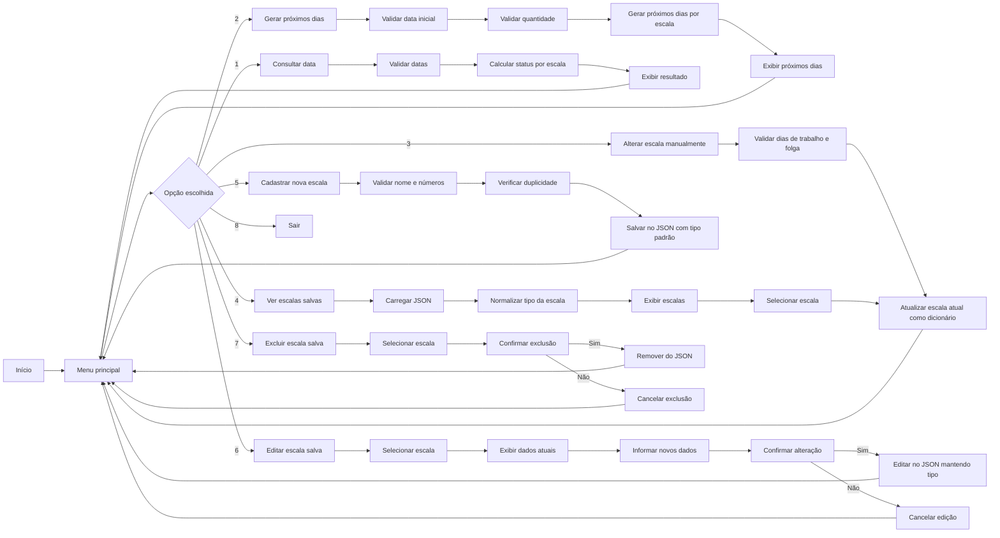
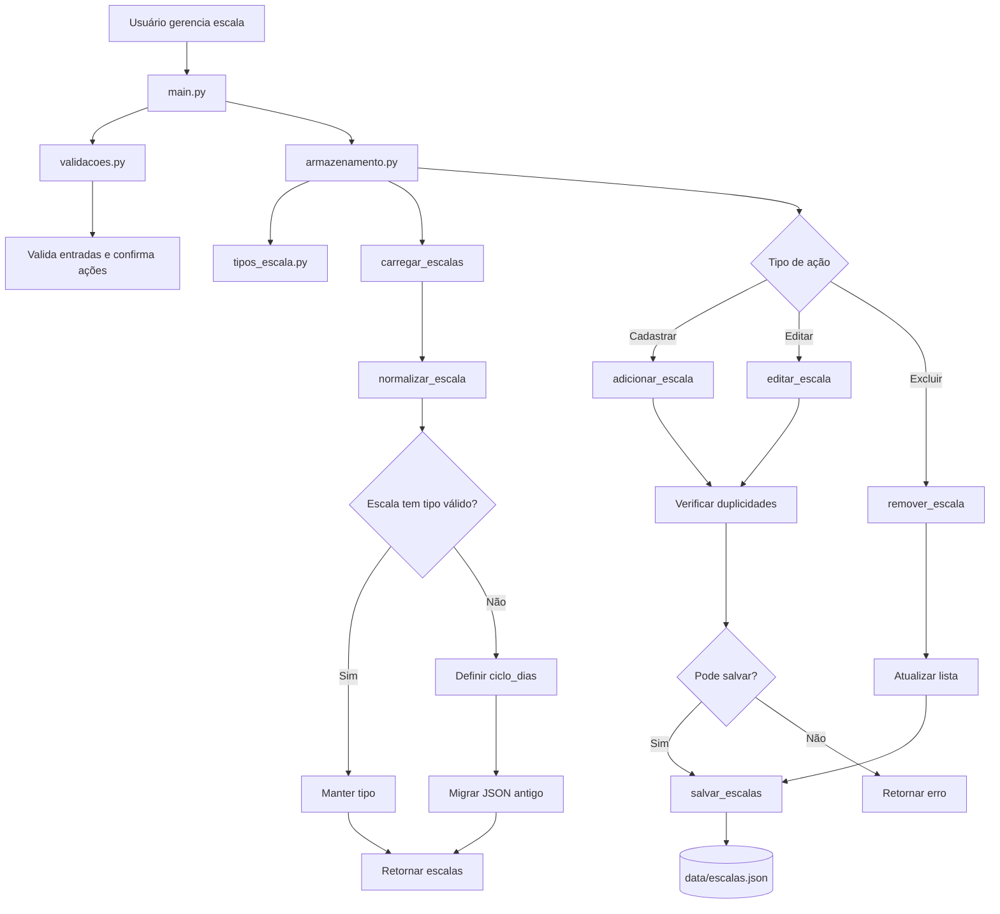
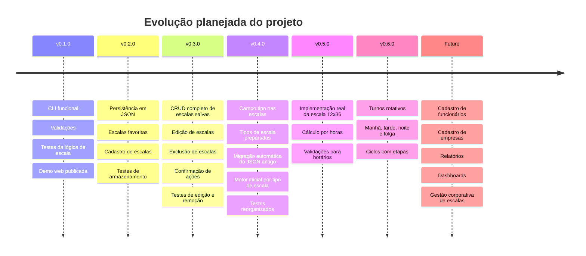

<p align="center">
  
</p>

<h1 align="center">⏰ Simulador de Escala de Trabalho</h1>

<p align="center">
  <strong>Aplicação em Python para consultar, simular, salvar, reutilizar, editar e excluir escalas de trabalho, com base preparada para múltiplos tipos de escala como ciclos por dias, ciclos por horas e turnos rotativos.</strong>
</p>

<p align="center">
  
</p>

<p align="center">
  
  
  
  
  
  
  
  
</p>

<p align="center">
  
  
  
</p>

<p align="center">
  <a href="https://dinox75.github.io/simulador-escala-trabalho/demo/" target="_blank">
    
  </a>
</p>

---

<table>
  <tr>
    <td width="25%" align="center">
      <h3>🔁 Ciclos</h3>
      <p>Calcula a posição de uma data dentro da escala.</p>
    </td>
    <td width="25%" align="center">
      <h3>📅 Consulta</h3>
      <p>Informa se uma data será de trabalho ou folga.</p>
    </td>
    <td width="25%" align="center">
      <h3>⭐ CRUD</h3>
      <p>Permite criar, listar, usar, editar e excluir escalas salvas.</p>
    </td>
    <td width="25%" align="center">
      <h3>🧩 Tipos</h3>
      <p>Base preparada para múltiplos tipos de escala.</p>
    </td>
  </tr>
</table>

---

## 📌 Versão atual

> **v0.4.0 - Preparação para múltiplos tipos de escala**

A versão `v0.4.0` prepara a arquitetura do projeto para evoluir além das escalas simples baseadas apenas em dias trabalhados e dias de folga.

Agora o sistema trabalha com o conceito de **tipo de escala**, permitindo que a base atual evolua futuramente para modelos mais avançados, como:

- `ciclo_dias` — escalas como `6x3`, `5x2`, `4x4` e variações baseadas em dias completos;
- `ciclo_horas` — base futura para escalas como `12x36`;
- `turno_rotativo` — base futura para escalas com manhã, tarde, noite e folga.

> [!IMPORTANT]
> Esta versão ainda não implementa o funcionamento completo de escalas `12x36` ou turnos rotativos.  
> Ela consolida a estrutura necessária para essas funcionalidades serem adicionadas nas próximas versões sem quebrar a base atual.

### Destaques da versão

| Categoria | Entrega |
|---|---|
| 🐍 Aplicação principal | CLI em Python |
| 🔁 Lógica de escala | Cálculo de trabalho e folga por ciclo |
| 🧩 Tipos de escala | Base para `ciclo_dias`, `ciclo_horas` e `turno_rotativo` |
| 💾 Persistência | Leitura e gravação em `data/escalas.json` |
| 🔄 Migração | Normalização automática de escalas antigas sem `tipo` |
| ⭐ Escalas favoritas | Cadastro, listagem, aplicação, edição e exclusão |
| 🧠 Validações | Nome obrigatório, números válidos, índice de lista, tipo de escala e confirmação de ações |
| 🛡️ Segurança no uso | Confirmação antes de editar ou excluir escalas |
| 🧪 Testes | Testes automatizados reorganizados por responsabilidade |
| 🌐 Demo web | Versão interativa em HTML, CSS e JavaScript |
| 🚀 Publicação | Demo hospedada com GitHub Pages |
| 📚 Documentação | README, visão de produto e changelog |
| 📄 Licença | Uso não comercial sem autorização |

---

## 🌐 Demo interativa

<table>
  <tr>
    <td align="center">
      <h3>🚀 Teste o projeto direto no navegador</h3>
      <p>
        A demo web permite simular escalas visualmente informando a data inicial, dias de trabalho, dias de folga e quantidade de dias para visualizar.
      </p>
      <p>
        <a href="https://dinox75.github.io/simulador-escala-trabalho/demo/" target="_blank">
          
        </a>
      </p>
      <p>
        <code>https://dinox75.github.io/simulador-escala-trabalho/demo/</code>
      </p>
    </td>
  </tr>
</table>

> [!NOTE]
> A aplicação principal do projeto é executada em Python pelo terminal. A demo web funciona como uma vitrine visual do conceito e poderá receber as melhorias mais recentes da CLI em versões futuras.

---

## 📌 Problema resolvido

Trabalhadores que atuam em escalas como **6x3, 5x2, 4x4 ou outros modelos de ciclo** muitas vezes precisam consultar manualmente se estarão trabalhando ou folgando em uma data futura.

Em ambientes com turnos, revezamentos e escalas diferentes, essa consulta pode gerar:

- dúvidas sobre dias de trabalho;
- confusão em períodos de folga;
- dificuldade para planejar compromissos;
- erros de comunicação;
- dependência de planilhas, murais ou consultas manuais;
- dificuldade para reutilizar configurações de escala já conhecidas;
- dificuldade para corrigir ou remover escalas cadastradas incorretamente;
- dificuldade para lidar com diferentes modelos de escala em um mesmo sistema.

Este projeto foi criado a partir de uma necessidade real observada no ambiente de trabalho: simplificar a consulta de escalas e transformar uma regra repetitiva em uma ferramenta prática, testável e expansível.

---

## ✅ Solução proposta

O **Simulador de Escala de Trabalho** é uma aplicação em **Python** que permite consultar, simular e gerenciar escalas de trabalho baseadas em ciclos.

A versão atual permite:

- consultar se uma data será de trabalho ou folga;
- visualizar os próximos dias da escala;
- alterar manualmente a quantidade de dias trabalhados e dias de folga;
- listar escalas favoritas salvas;
- aplicar uma escala salva como escala atual;
- cadastrar novas escalas pelo terminal;
- editar escalas já cadastradas;
- excluir escalas salvas;
- confirmar ações sensíveis antes de salvar ou remover dados;
- bloquear cadastro com nome duplicado;
- bloquear cadastro com mesma configuração de dias trabalhados e folga;
- persistir dados em arquivo JSON;
- identificar o tipo da escala salva;
- normalizar escalas antigas sem campo `tipo`;
- migrar automaticamente dados antigos para o novo formato;
- testar a lógica principal, os tipos de escala e o armazenamento com testes automatizados.

> [!IMPORTANT]
> O projeto começa como uma solução CLI, mas foi estruturado com mentalidade de produto: código modular, testes, documentação, persistência, visão futura e uma demo acessível para apresentação.

---

## 🎯 Objetivo do projeto

Criar uma ferramenta prática para simular e gerenciar escalas de trabalho de forma automática, reduzindo consultas manuais e facilitando o planejamento do usuário.

| Recurso | Descrição |
|---|---|
| 📅 Definir data inicial | Informa quando o ciclo da escala começa |
| 🔎 Consultar uma data | Verifica se o usuário estará trabalhando ou folgando |
| 📆 Visualizar próximos dias | Gera uma sequência futura da escala |
| ⚙️ Alterar escala manualmente | Permite mudar os dias de trabalho e folga durante a execução |
| ⭐ Escalas favoritas | Permite salvar e reutilizar configurações de escala |
| ✏️ Editar escalas salvas | Permite corrigir nome, dias trabalhados e dias de folga |
| 🗑️ Excluir escalas salvas | Remove escalas que não são mais necessárias |
| 🛡️ Confirmação de ações | Evita alterações e exclusões acidentais |
| 🧩 Tipos de escala | Prepara o sistema para diferentes modelos de escala |
| 🔄 Migração automática | Atualiza escalas antigas para o novo formato |
| 💾 Persistência em JSON | Mantém escalas salvas fora do código |
| 🧪 Validar a lógica | Usa testes automatizados para reduzir erros em futuras alterações |
| 🌐 Experimentar visualmente | Permite testar o conceito em uma demo web simples |

---

## 🧠 Exemplo prático

Imagine a seguinte situação:

| Informação | Valor |
|---|---|
| Data inicial da escala | `01/05/2026` |
| Modelo de escala | `6x3` |
| Tipo de escala | `ciclo_dias` |
| Data consultada | `07/05/2026` |

Resultado esperado:

```text
Na data 07/05/2026, você estará: 🌙 Folga
```

### Interpretação

Uma escala **6x3** significa:

```text
6 dias trabalhando + 3 dias folgando = ciclo de 9 dias
```

Representação visual do ciclo:

<p align="center">
  
  
  
  
  
  
  
  
  
</p>

---

## 🧩 Tipos de escala

A partir da versão `v0.4.0`, o projeto passou a trabalhar com o conceito de **tipo de escala**.

Essa mudança prepara a aplicação para crescer sem depender apenas de `dias_trabalho` e `dias_folga`.

### Tipos preparados

| Tipo técnico | Nome amigável | Status | Objetivo |
|---|---|---|---|
| `ciclo_dias` | Ciclo por dias | ✅ Base atual | Escalas como `6x3`, `5x2`, `4x4` |
| `ciclo_horas` | Ciclo por horas | 🔜 Preparado | Base futura para `12x36` |
| `turno_rotativo` | Turno rotativo | 🔜 Preparado | Base futura para manhã, tarde, noite e folga |

### Exemplo de escala no novo formato

```json
[
    {
        "nome": "Escala padrão 6x3",
        "tipo": "ciclo_dias",
        "dias_trabalho": 6,
        "dias_folga": 3
    },
    {
        "nome": "Escala administrativa 5x2",
        "tipo": "ciclo_dias",
        "dias_trabalho": 5,
        "dias_folga": 2
    }
]
```

> [!NOTE]
> Escalas antigas que não possuem o campo `tipo` são corrigidas automaticamente para `ciclo_dias`.

---

## ⭐ Escalas favoritas

A partir da versão `v0.2.0`, o projeto passou a permitir o cadastro e reutilização de escalas favoritas.

Na versão `v0.3.0`, esse recurso evoluiu para um **CRUD completo de escalas salvas**, permitindo criar, listar, aplicar, editar e excluir configurações persistidas em JSON.

Na versão `v0.4.0`, as escalas salvas passaram a receber o campo `tipo`, preparando a aplicação para múltiplos modelos de escala.

Essas escalas ficam armazenadas em:

```text
data/escalas.json
```

### Operações disponíveis

| Operação | Comportamento |
|---|---|
| Criar escala | Cadastra uma nova escala no JSON |
| Listar escalas | Exibe todas as escalas salvas |
| Usar escala | Aplica uma escala salva como escala atual |
| Editar escala | Atualiza nome, dias trabalhados e dias de folga |
| Excluir escala | Remove uma escala salva |
| Confirmar ação | Solicita confirmação antes de editar ou excluir |
| Normalizar escala | Adiciona `tipo` quando a escala antiga não possui esse campo |
| Migrar JSON | Atualiza automaticamente o arquivo antigo para o novo formato |

### Regras aplicadas

| Regra | Comportamento |
|---|---|
| Nome duplicado | O sistema bloqueia o cadastro ou edição |
| Configuração duplicada | O sistema bloqueia escalas com mesmos dias de trabalho e folga |
| Índice inválido | O sistema impede operação fora da lista |
| Tipo ausente | O sistema define automaticamente como `ciclo_dias` |
| Tipo inválido | O sistema corrige para o tipo padrão |
| Confirmação negativa | A edição ou exclusão é cancelada |
| Escala válida | A escala é salva ou atualizada no JSON |
| Escala salva | Pode ser aplicada como escala atual pelo menu |

> [!NOTE]
> Na versão atual, duas escalas com a mesma quantidade de dias trabalhados e dias de folga são consideradas duplicadas. Em versões futuras, essa regra poderá evoluir para considerar turnos, horários, rotação e tipo de escala.

---

## ⚙️ Funcionalidades

| Funcionalidade | Status |
|---|---|
| Consultar uma data específica | ✅ Implementado |
| Gerar próximos dias da escala | ✅ Implementado |
| Alterar escala manualmente pelo menu | ✅ Implementado |
| Validação de datas | ✅ Implementado |
| Validação de entradas numéricas | ✅ Implementado |
| Validação de opções do menu | ✅ Implementado |
| Validação de índice em listas | ✅ Implementado |
| Validação de texto obrigatório | ✅ Implementado |
| Confirmação de ações sensíveis | ✅ Implementado |
| Interface organizada em módulo próprio | ✅ Implementado |
| Formatação visual de status no terminal | ✅ Implementado |
| Persistência em JSON | ✅ Implementado |
| Listar escalas salvas | ✅ Implementado |
| Aplicar escala salva como escala atual | ✅ Implementado |
| Cadastrar nova escala pelo terminal | ✅ Implementado |
| Editar escala salva pelo terminal | ✅ Implementado |
| Excluir escala salva pelo terminal | ✅ Implementado |
| Bloquear nome duplicado | ✅ Implementado |
| Bloquear configuração duplicada | ✅ Implementado |
| Campo `tipo` nas escalas salvas | ✅ Implementado |
| Normalização de escalas antigas sem `tipo` | ✅ Implementado |
| Migração automática do JSON antigo | ✅ Implementado |
| Validação de tipos de escala suportados | ✅ Implementado |
| Nomes amigáveis para tipos de escala | ✅ Implementado |
| Motor inicial de cálculo por tipo de escala | ✅ Implementado |
| `main.py` usando escala atual como dicionário | ✅ Implementado |
| Testes automatizados da lógica principal | ✅ Implementado |
| Testes automatizados do armazenamento | ✅ Implementado |
| Testes automatizados dos tipos de escala | ✅ Implementado |
| Demo web interativa | ✅ Implementado |
| GitHub Pages para demo | ✅ Implementado |
| README profissional | ✅ Implementado |
| Documento de visão futura do produto | ✅ Implementado |
| Changelog | ✅ Implementado |
| Licença de uso não comercial | ✅ Implementado |
| Implementar `12x36` real | 🔜 Planejado |
| Implementar `ciclo_horas` no cálculo | 🔜 Planejado |
| Implementar turnos rotativos | 🔜 Planejado |
| Atualizar demo web com tipos de escala | 🔜 Planejado |
| Calendário mensal visual avançado | 🔜 Planejado |
| Cadastro de funcionários | 🔜 Planejado |
| Exportação de relatórios | 🔜 Planejado |
| Interface gráfica ou web completa | 🔜 Planejado |

---

## 🖥️ Demonstração no terminal

```text
==========================================
        ⏰ SIMULADOR DE ESCALAS
==========================================
Escala atual: 6x3
------------------------------------------
1 - Consultar uma data
2 - Ver próximos dias
3 - Alterar escala
4 - Ver escalas salvas
5 - Cadastrar nova escala
6 - Editar escala salva
7 - Excluir escala salva
8 - Sair
==========================================
```

### Consultar uma data

```text
Escolha uma opção: 1

Digite a data inicial da escala (dd/mm/aaaa): 01/05/2026
Digite a data que deseja consultar (dd/mm/aaaa): 07/05/2026

Na data 07/05/2026, você estará: 🌙 Folga
```

### Ver próximos dias

```text
==== PRÓXIMOS DIAS ====

01/05/2026: 🟢 Trabalhando
02/05/2026: 🟢 Trabalhando
03/05/2026: 🟢 Trabalhando
04/05/2026: 🟢 Trabalhando
05/05/2026: 🟢 Trabalhando
06/05/2026: 🟢 Trabalhando
07/05/2026: 🌙 Folga
08/05/2026: 🌙 Folga
09/05/2026: 🌙 Folga
10/05/2026: 🟢 Trabalhando
```

### Listar escalas salvas

```text
==== ESCALAS SALVAS ====

1 - Escala padrão 6x3
    Tipo: Ciclo por dias
    Dias trabalhados: 6
    Dias de folga: 3

2 - Escala administrativa 5x2
    Tipo: Ciclo por dias
    Dias trabalhados: 5
    Dias de folga: 2
```

### Cadastrar nova escala

```text
Digite o nome da escala: Escala teste 3x2
Digite a quantidade de dias trabalhados: 3
Digite a quantidade de dias de folga: 2

Escala cadastrada com sucesso!
```

### Editar escala salva

```text
Escolha uma escala para editar: 1

Escala selecionada:
Nome atual: Escala padrão 6x3
Tipo atual: Ciclo por dias
Dias trabalhados atuais: 6
Dias de folga atuais: 3

Digite o novo nome da escala: Escala principal 6x3
Digite a nova quantidade de dias trabalhados: 6
Digite a nova quantidade de dias de folga: 3

Resumo da alteração:
Nome: Escala padrão 6x3 -> Escala principal 6x3
Tipo: Ciclo por dias
Dias trabalhados: 6 -> 6
Dias de folga: 3 -> 3

Deseja salvar essa alteração? [s/n]: s

Escala editada com sucesso!
```

### Excluir escala salva

```text
Escolha uma escala para excluir: 2

Tem certeza que deseja excluir a escala 'Escala administrativa 5x2'? [s/n]: s

Escala 'Escala administrativa 5x2' removida com sucesso!
```

---

## 🧩 Organograma técnico

```mermaid
flowchart TD
    A[Usuário] --> B[main.py]

    B --> C[validacoes.py]
    B --> D[escala.py]
    B --> E[interface.py]
    B --> F[armazenamento.py]
    B --> H[tipos_escala.py]

    C --> C1[Valida datas]
    C --> C2[Valida números]
    C --> C3[Valida opções]
    C --> C4[Valida índice de lista]
    C --> C5[Valida texto obrigatório]
    C --> C6[Confirma ações do usuário]

    D --> D1[Calcula status]
    D --> D2[Gera próximos dias]
    D --> D3[Aplica regra do ciclo]
    D --> D4[Calcula por tipo de escala]

    E --> E1[Exibe menu]
    E --> E2[Exibe resultados]
    E --> E3[Exibe escalas salvas]
    E --> E4[Formata status]
    E --> E5[Exibe tipo amigável]

    F --> F1[Carrega escalas]
    F --> F2[Salva escalas]
    F --> F3[Adiciona nova escala]
    F --> F4[Edita escala existente]
    F --> F5[Remove escala salva]
    F --> F6[Valida duplicidades]
    F --> F7[Normaliza escalas antigas]
    F --> F8[Migra JSON antigo]
    F --> G[(data/escalas.json)]

    H --> H1[Centraliza tipos suportados]
    H --> H2[Valida tipo de escala]
    H --> H3[Retorna nome amigável]
```



---

## 🔄 Fluxo de funcionamento



---

## 🧱 Arquitetura do projeto

```text
simulador-escala-trabalho/
│
├── assets/
│   └── banner.png
│
├── data/
│   └── escalas.json
│
├── docs/
│   ├── visao_produto.md
│   └── demo/
│       ├── index.html
│       ├── style.css
│       └── script.js
│
├── tests/
│   ├── test_escala.py
│   ├── test_armazenamento.py
│   └── test_tipos_escalas.py
│
├── armazenamento.py
├── escala.py
├── interface.py
├── main.py
├── tipos_escala.py
├── validacoes.py
├── pytest.ini
├── requirements.txt
├── LICENSE
├── CHANGELOG.md
└── README.md
```

### Responsabilidade dos arquivos

| Arquivo/Pasta | Responsabilidade |
|---|---|
| `assets/` | Armazena recursos visuais do projeto |
| `banner.png` | Banner principal utilizado no README |
| `data/` | Armazena dados utilizados pelo sistema |
| `escalas.json` | Guarda as escalas favoritas cadastradas |
| `docs/` | Documentação complementar e visão futura do produto |
| `docs/demo/` | Demo web interativa publicada via GitHub Pages |
| `visao_produto.md` | Documento estratégico sobre evolução do projeto |
| `tests/` | Testes automatizados do projeto |
| `test_escala.py` | Testes da lógica principal e do motor inicial por tipo de escala |
| `test_armazenamento.py` | Testes de leitura, salvamento, cadastro, edição, remoção, normalização e migração |
| `test_tipos_escalas.py` | Testes dos tipos de escala suportados e nomes amigáveis |
| `armazenamento.py` | Carrega, salva, cadastra, edita, remove, normaliza e migra escalas em JSON |
| `escala.py` | Contém a lógica de cálculo da escala e funções por tipo de escala |
| `interface.py` | Centraliza menus, mensagens e exibição no terminal |
| `main.py` | Controla o fluxo principal da aplicação |
| `tipos_escala.py` | Centraliza tipos suportados, validação de tipos e nomes amigáveis |
| `validacoes.py` | Centraliza validações e confirmações de entrada do usuário |
| `pytest.ini` | Configuração para execução dos testes |
| `requirements.txt` | Lista dependências do projeto |
| `LICENSE` | Licença proprietária de uso não comercial |
| `CHANGELOG.md` | Histórico de alterações do projeto |
| `README.md` | Documentação principal do projeto |

---

## 🧮 Como funciona a lógica

A lógica principal usa o conceito de **ciclo**.

Em uma escala `6x3`:

```text
ciclo = dias de trabalho + dias de folga
ciclo = 6 + 3
ciclo = 9 dias
```

Depois, o sistema calcula a diferença entre a data consultada e a data inicial da escala:

```text
dias_passados = data_consulta - data_inicio
posicao_ciclo = dias_passados % ciclo
```

A decisão acontece assim:

```text
Se posicao_ciclo < dias_trabalho:
    Trabalhando
Senão:
    Folga
```

Essa abordagem permite reaproveitar a mesma lógica para diferentes modelos de escala baseados em dias completos.

### Motor inicial por tipo de escala

Na versão `v0.4.0`, o projeto passou a preparar funções que recebem uma escala completa:

```python
calcular_status_por_escala(escala, data_inicio, data_consulta)
gerar_proximos_dias_por_escala(escala, data_inicio, quantidade_dias)
```

Isso permite que o sistema deixe de depender apenas de variáveis soltas como:

```python
dias_trabalho = 6
dias_folga = 3
```

E passe a trabalhar com uma estrutura mais completa:

```python
escala_atual = {
    "nome": "Escala manual",
    "tipo": "ciclo_dias",
    "dias_trabalho": 6,
    "dias_folga": 3
}
```

> [!WARNING]
> Escalas baseadas em horas, como `12x36`, ainda exigem uma lógica diferente da atual, pois envolvem controle por horário e não apenas por dias completos.

---

## 💾 Como funciona a persistência

A persistência foi adicionada para permitir que escalas sejam salvas fora do código.

O arquivo responsável pelo armazenamento é:

```text
data/escalas.json
```

O módulo responsável por manipular esse arquivo é:

```text
armazenamento.py
```

### Funções principais do armazenamento

| Função | Responsabilidade |
|---|---|
| `carregar_escalas()` | Lê as escalas salvas no JSON |
| `salvar_escalas(escalas)` | Salva a lista de escalas no JSON |
| `adicionar_escala(nome, dias_trabalho, dias_folga)` | Cadastra uma nova escala com tipo padrão |
| `editar_escala(indice, novo_nome, novos_dias_trabalho, novos_dias_folga)` | Edita uma escala existente mantendo o tipo |
| `remover_escala(indice)` | Remove uma escala salva |
| `normalizar_escala(escala)` | Garante que a escala possua um tipo válido |

### Fluxo de persistência



---

## 🛠️ Tecnologias utilizadas

<p align="center">
  
  
  
  
  
  
  
  
  
  
</p>

### Conceitos praticados

- lógica de programação;
- funções;
- modularização;
- manipulação de datas;
- estruturas condicionais;
- estruturas de repetição;
- validação de entrada;
- leitura e escrita de arquivos JSON;
- persistência de dados;
- CRUD em arquivo JSON;
- cálculo de ciclos;
- confirmação de ações do usuário;
- migração de dados antigos;
- normalização de dados;
- separação de responsabilidades;
- testes automatizados;
- organização de projeto;
- documentação para portfólio;
- visão de evolução de produto;
- criação de demo web estática;
- publicação com GitHub Pages.

---

## 🚀 Como executar

### 1. Clone o repositório

```bash
git clone https://github.com/Dinox75/simulador-escala-trabalho.git
```

### 2. Acesse a pasta do projeto

```bash
cd simulador-escala-trabalho
```

### 3. Instale as dependências

```bash
pip install -r requirements.txt
```

### 4. Execute o projeto

```bash
python main.py
```

Ou, dependendo do ambiente:

```bash
python3 main.py
```

---

## 🧪 Testes automatizados

O projeto possui testes com `pytest` para validar a lógica de escala, os tipos de escala e o armazenamento em JSON.

### Executar os testes

```bash
python -m pytest
```

### O que está sendo testado

| Arquivo de teste | O que valida |
|---|---|
| `tests/test_escala.py` | Cálculo de trabalho e folga |
| `tests/test_escala.py` | Geração dos próximos dias da escala |
| `tests/test_escala.py` | Motor inicial de cálculo por tipo de escala |
| `tests/test_escala.py` | Tratamento de tipo ainda não implementado |
| `tests/test_armazenamento.py` | Salvamento e carregamento de escalas |
| `tests/test_armazenamento.py` | Cadastro de nova escala |
| `tests/test_armazenamento.py` | Remoção de escala salva |
| `tests/test_armazenamento.py` | Edição de escala salva |
| `tests/test_armazenamento.py` | Bloqueio de nome duplicado |
| `tests/test_armazenamento.py` | Bloqueio de configuração duplicada |
| `tests/test_armazenamento.py` | Normalização de escala antiga sem tipo |
| `tests/test_armazenamento.py` | Migração automática do JSON antigo |
| `tests/test_armazenamento.py` | Correção de tipo inválido para padrão |
| `tests/test_tipos_escalas.py` | Validação dos tipos suportados |
| `tests/test_tipos_escalas.py` | Nomes amigáveis dos tipos de escala |

### Exemplo de saída esperada

```text
collected 26 items

tests/test_armazenamento.py ...............
tests/test_escala.py .....
tests/test_tipos_escalas.py ........

26 passed
```

> [!NOTE]
> A quantidade exata de testes pode variar conforme novas validações forem adicionadas ao projeto.

---

## 🧪 Testes manuais sugeridos

| Cenário | Entrada | Resultado esperado |
|---|---|---|
| Consultar primeiro dia da escala | `01/05/2026` em escala `6x3` | Trabalhando |
| Consultar sexto dia da escala | `06/05/2026` em escala `6x3` | Trabalhando |
| Consultar sétimo dia da escala | `07/05/2026` em escala `6x3` | Folga |
| Aplicar escala salva | Selecionar `5x2` | Menu passa a exibir `5x2` |
| Cadastrar escala nova | Nome novo + configuração nova | Cadastro realizado |
| Cadastrar nome repetido | Mesmo nome de uma escala existente | Cadastro bloqueado |
| Cadastrar configuração repetida | Nome diferente + mesmos dias | Cadastro bloqueado |
| Editar escala válida | Selecionar escala + novos dados válidos | Escala atualizada |
| Cancelar edição | Digitar `n` na confirmação | Nenhuma alteração salva |
| Excluir escala válida | Selecionar escala + confirmar com `s` | Escala removida |
| Cancelar exclusão | Digitar `n` na confirmação | Escala permanece salva |
| Carregar escala antiga sem tipo | JSON antigo sem `tipo` | Sistema define `ciclo_dias` |
| Exibir escala salva | Escala com tipo | Terminal mostra nome amigável do tipo |

---

## 🧭 Roadmap



### Implementado até a versão atual

- [x] Criar lógica de cálculo de escala
- [x] Consultar status de uma data
- [x] Gerar próximos dias da escala
- [x] Criar menu interativo
- [x] Permitir alteração manual da escala
- [x] Separar validações em módulo próprio
- [x] Separar exibições em módulo próprio
- [x] Criar módulo de armazenamento
- [x] Salvar escalas em JSON
- [x] Listar escalas salvas
- [x] Aplicar escala salva como escala atual
- [x] Cadastrar nova escala pelo terminal
- [x] Editar escala salva pelo terminal
- [x] Excluir escala salva pelo terminal
- [x] Confirmar edição antes de salvar alteração
- [x] Confirmar exclusão antes de remover escala
- [x] Bloquear nome duplicado
- [x] Bloquear configuração duplicada
- [x] Adicionar campo `tipo` nas escalas salvas
- [x] Criar módulo `tipos_escala.py`
- [x] Validar tipos de escala suportados
- [x] Criar nomes amigáveis para tipos de escala
- [x] Exibir tipo da escala no terminal
- [x] Normalizar escalas antigas sem `tipo`
- [x] Migrar automaticamente JSON antigo
- [x] Criar motor inicial de cálculo por tipo de escala
- [x] Preparar `main.py` para usar escala atual como dicionário
- [x] Adicionar testes automatizados da lógica principal
- [x] Adicionar testes automatizados do armazenamento
- [x] Adicionar testes automatizados dos tipos de escala
- [x] Reorganizar testes por responsabilidade
- [x] Criar documentação de visão do produto
- [x] Adicionar licença de uso não comercial
- [x] Criar demo web inicial
- [x] Publicar demo com GitHub Pages

### Próximas melhorias

- [ ] Implementar cálculo real de escala `12x36`
- [ ] Criar suporte completo para `ciclo_horas`
- [ ] Adicionar validação de horários
- [ ] Implementar turnos rotativos
- [ ] Permitir escolha do tipo de escala no menu
- [ ] Atualizar a demo web com tipos de escala
- [ ] Atualizar a demo web com edição de escalas salvas
- [ ] Atualizar a demo web com exclusão de escalas salvas
- [ ] Melhorar mensagens visuais da interface CLI
- [ ] Permitir salvar a escala atual escolhida como preferência
- [ ] Criar visualização mensal mais completa
- [ ] Adicionar suporte para múltiplos funcionários
- [ ] Permitir cadastro de turnos
- [ ] Exportar resultados em `.txt`, `.csv` ou `.pdf`
- [ ] Criar interface gráfica ou web completa
- [ ] Evoluir para sistema corporativo de gestão de escalas

---

## 💼 Valor profissional

Este projeto demonstra habilidades importantes para desenvolvimento de software:

<table>
  <tr>
    <td align="center">
      <strong>🧠 Lógica</strong><br>
      Cálculo de ciclos e regras
    </td>
    <td align="center">
      <strong>📅 Datas</strong><br>
      Manipulação com datetime
    </td>
    <td align="center">
      <strong>🧩 Modularização</strong><br>
      Separação de responsabilidades
    </td>
  </tr>
  <tr>
    <td align="center">
      <strong>💾 JSON</strong><br>
      Persistência de dados
    </td>
    <td align="center">
      <strong>🧪 Testes</strong><br>
      Validação automatizada com pytest
    </td>
    <td align="center">
      <strong>🌐 Demo Web</strong><br>
      Apresentação visual do conceito
    </td>
  </tr>
  <tr>
    <td align="center">
      <strong>⭐ CRUD</strong><br>
      Gerenciamento completo de escalas
    </td>
    <td align="center">
      <strong>🛡️ Validações</strong><br>
      Prevenção de erros de uso
    </td>
    <td align="center">
      <strong>🧩 Arquitetura</strong><br>
      Base preparada para evoluir
    </td>
  </tr>
</table>

> [!IMPORTANT]
> O objetivo não é apenas criar um script, mas desenvolver um projeto apresentável, organizado, testável e com potencial de evolução para um sistema real.

---

## 🏢 Visão futura do produto

Este projeto também possui uma documentação estratégica descrevendo sua possível evolução para uma plataforma corporativa de gestão de escalas.

A ideia futura envolve:

- cadastro de empresas;
- cadastro de funcionários;
- gestão de escalas por colaborador;
- múltiplos tipos de escala;
- turnos rotativos;
- escala `12x36`;
- feriados;
- férias;
- paradas programadas;
- relatórios individuais e gerais;
- integração com sistemas de ponto;
- painel para empresa;
- painel para colaborador;
- dashboards para acompanhamento;
- alertas e notificações.

Leia mais em:

```text
docs/visao_produto.md
```

---

## 📝 Changelog

As mudanças do projeto são registradas no arquivo:

```text
CHANGELOG.md
```

Versões principais:

| Versão | Entrega |
|---|---|
| `v0.1.0` | CLI funcional, lógica de escala, validações e testes iniciais |
| `v0.2.0` | Escalas favoritas com persistência em JSON |
| `v0.3.0` | CRUD completo de escalas salvas |
| `v0.4.0` | Preparação para múltiplos tipos de escala |

---

## 👨‍💻 Autor

**Vinicius Lima**

Estudante de **Análise de Dados e Desenvolvimento de Sistemas**, com foco em desenvolvimento prático, automação, análise de dados e construção de projetos para GitHub e LinkedIn.

### Áreas de interesse

<p>
  
  
  
  
  
  
</p>

---

## 📄 Licença

Este projeto está protegido por uma **Licença Proprietária de Uso Não Comercial**.

O código está disponível publicamente para fins de estudo, avaliação técnica, portfólio e recrutamento.  
O uso comercial, redistribuição, venda, cópia substancial ou criação de soluções derivadas para fins comerciais não é permitido sem autorização prévia e por escrito do autor.

Para mais detalhes, consulte o arquivo [LICENSE](./LICENSE).

---

<p align="center">
  <strong>Projeto desenvolvido como parte da minha jornada de aprendizado, prática e evolução profissional em tecnologia.</strong>
</p>

<p align="center">
  <a href="https://dinox75.github.io/simulador-escala-trabalho/demo/" target="_blank">
    
  </a>
  
  
  
</p>

<p align="center">
  
</p>

<p align="center">
  ⭐ Se este projeto te ajudou ou serviu como inspiração, considere deixar uma estrela no repositório.
</p>