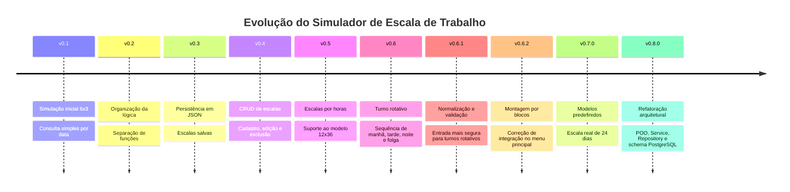
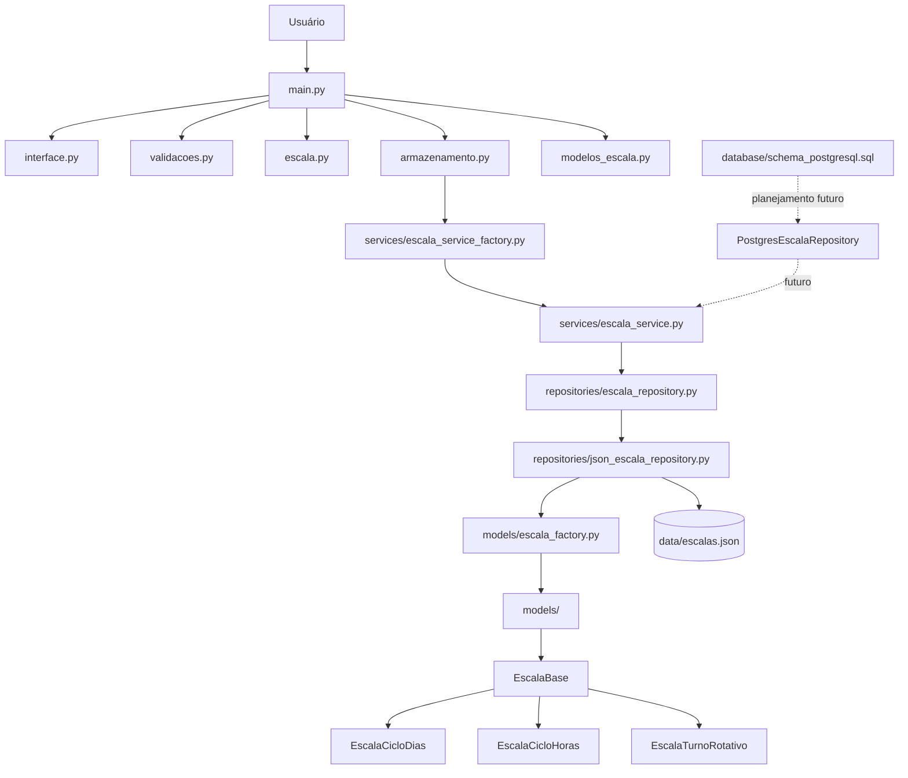
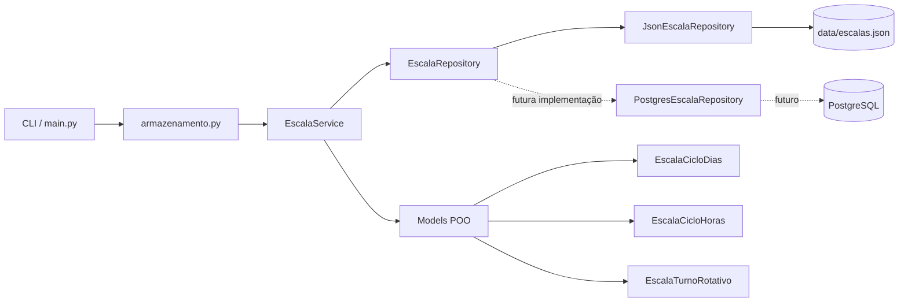
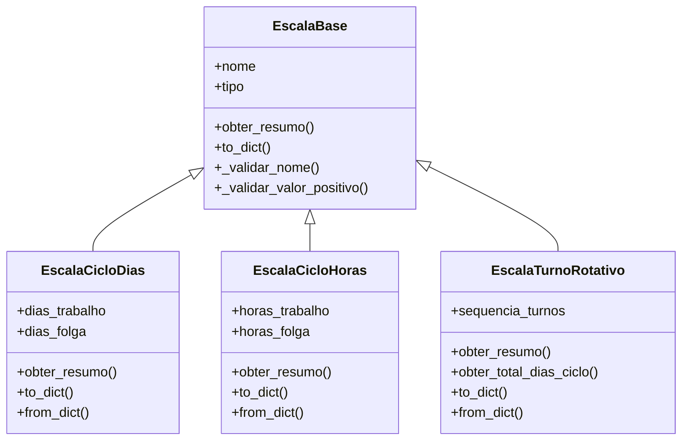
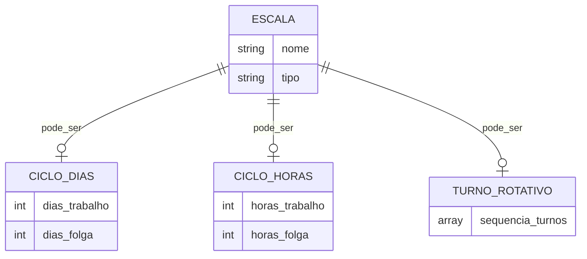
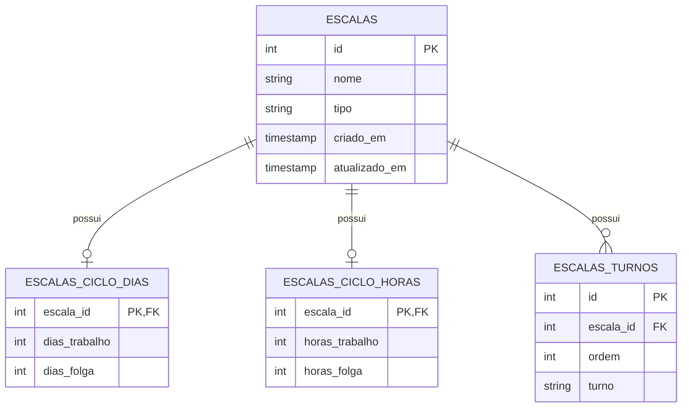
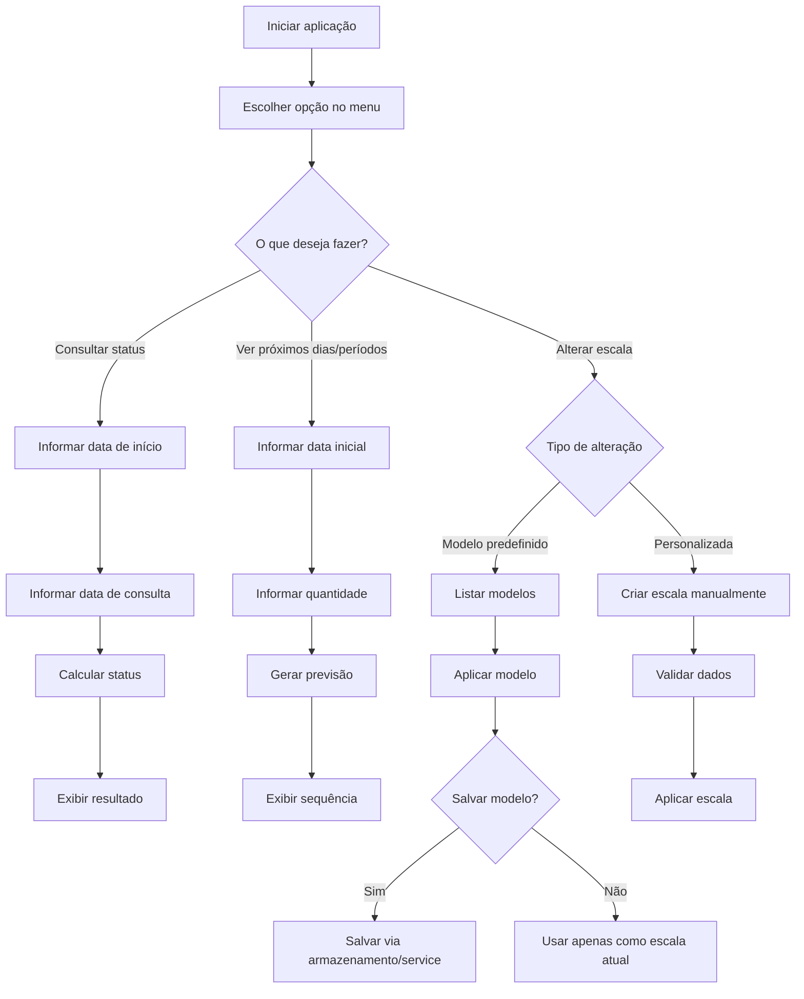
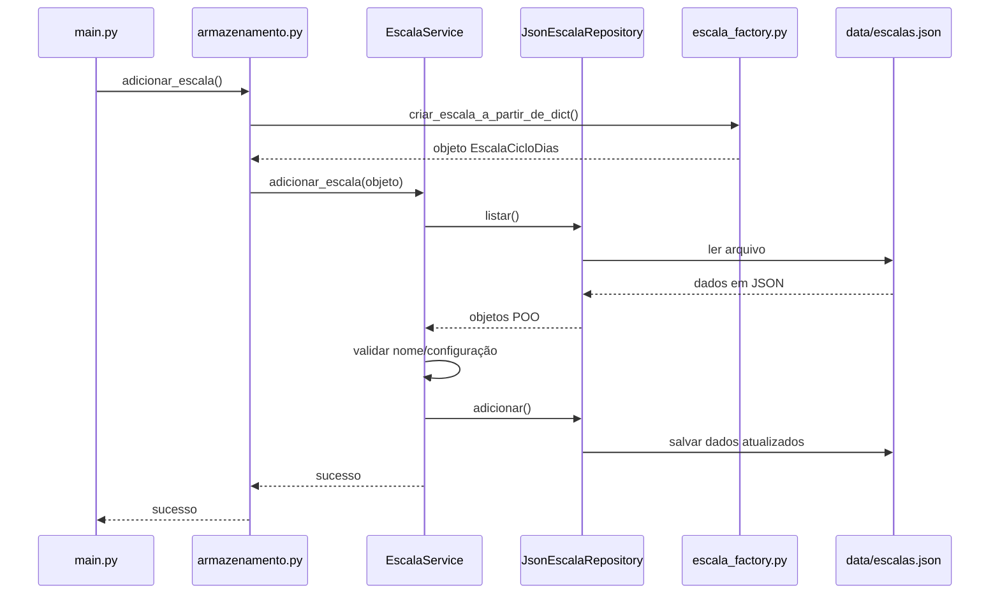
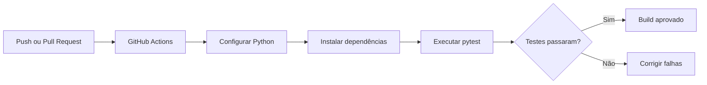
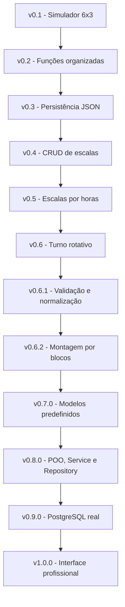

<p align="center">
  
</p>

<h1 align="center">⏰ Simulador de Escala de Trabalho</h1>

<p align="center">
  <strong>Aplicação em Python para consultar, simular, cadastrar, editar, reutilizar e excluir escalas de trabalho por dias, por horas e por turnos rotativos, com modelos predefinidos, persistência em JSON, testes automatizados, arquitetura em camadas e preparação para PostgreSQL.</strong>
</p>

<p align="center">
  
</p>

<p align="center">
  
  
  
  
  
  
  
  
</p>

<p align="center">
  <a href="https://dinox75.github.io/simulador-escala-trabalho/demo/" target="_blank">
    
  </a>
</p>

<p align="center">
  <a href="#-sobre-o-projeto">Sobre</a> •
  <a href="#-versão-atual">Versão atual</a> •
  <a href="#-funcionalidades">Funcionalidades</a> •
  <a href="#-arquitetura-da-v080">Arquitetura</a> •
  <a href="#-schemas-do-projeto">Schemas</a> •
  <a href="#-testes-automatizados">Testes</a> •
  <a href="#-como-executar-o-projeto">Executar</a> •
  <a href="#-roadmap">Roadmap</a>
</p>

---

<table>
  <tr>
    <td width="25%" align="center">
      <h3>📆 Escalas por dias</h3>
      <p>Modelos como 6x3, 5x2 e 4x2.</p>
    </td>
    <td width="25%" align="center">
      <h3>⏱️ Escalas por horas</h3>
      <p>Suporte para ciclos como 12x36.</p>
    </td>
    <td width="25%" align="center">
      <h3>🔄 Turno rotativo</h3>
      <p>Sequências manuais, por blocos e modelos prontos.</p>
    </td>
    <td width="25%" align="center">
      <h3>🧱 Arquitetura</h3>
      <p>POO, Service, Repository e preparação para PostgreSQL.</p>
    </td>
  </tr>
</table>

---

## 📌 Sobre o projeto

O **Simulador de Escala de Trabalho** é uma aplicação em Python criada para consultar, simular e gerenciar escalas de trabalho de forma simples, prática e evolutiva.

A aplicação começou como um simulador de escala `6x3`, mas evoluiu para uma base mais completa, com suporte a:

* escalas por dias;
* escalas por horas;
* turnos rotativos;
* montagem de turnos por blocos;
* modelos predefinidos;
* escala real de 24 dias;
* cadastro, edição, exclusão e aplicação de escalas salvas;
* persistência em arquivo JSON;
* testes automatizados;
* arquitetura com Programação Orientada a Objetos;
* camada de service;
* camada de repository;
* preparação para futura integração com PostgreSQL;
* demo web interativa para apresentação do projeto.

O foco do projeto é transformar uma necessidade comum de trabalhadores em uma solução simples de consultar, fácil de expandir e tecnicamente boa para compor um portfólio de desenvolvimento.

---

## 🚀 Versão atual

> **v0.8.0 - Refatoração arquitetural com POO e preparação para banco de dados**

A versão `v0.8.0` marca uma mudança importante na estrutura interna do projeto.

Até a `v0.7.0`, o sistema já possuía uma boa quantidade de funcionalidades, como modelos predefinidos, escala real de 24 dias, turnos rotativos e persistência em JSON.

Na `v0.8.0`, o foco passou a ser a **arquitetura interna**.

A aplicação ganhou:

* modelos orientados a objetos;
* classe base para escalas;
* factory para converter dicionários em objetos;
* camada de repository;
* contrato base para repositories;
* camada de service;
* factory para criação do service;
* integração gradual do `armazenamento.py` com a nova arquitetura;
* schema inicial planejado para PostgreSQL;
* testes de integração cobrindo a migração.

> [!IMPORTANT]
> Na versão atual, a aplicação ainda usa JSON como persistência principal. O PostgreSQL já possui schema planejado, mas a integração real com banco ficará para uma versão futura.

---

## ✅ Principais entregas da v0.8.0

| Categoria           | Entrega                                                     |
| ------------------- | ----------------------------------------------------------- |
| 🧠 POO              | Criação de classes para representar escalas                 |
| 🧱 Classe base      | Criação da `EscalaBase`                                     |
| 📆 Escala por dias  | Classe `EscalaCicloDias`                                    |
| ⏱️ Escala por horas | Classe `EscalaCicloHoras`                                   |
| 🔄 Turno rotativo   | Classe `EscalaTurnoRotativo`                                |
| 🔁 Conversão        | Factory para converter `dict` em objeto e objeto em `dict`  |
| 💾 Repository       | Criação do `JsonEscalaRepository`                           |
| 📜 Contrato         | Criação de contrato base `EscalaRepository`                 |
| 🧩 Service          | Criação do `EscalaService`                                  |
| 🏗️ Integração      | `armazenamento.py` integrado ao service                     |
| 🐘 Banco            | Schema PostgreSQL inicial criado                            |
| 🧪 Testes           | Testes de models, factory, repository, service e integração |

---

## 📊 Gráfico de evolução



---

## 📌 Problema resolvido

Muitas pessoas trabalham em escalas que se repetem em ciclos. Nem sempre é fácil saber rapidamente se em determinada data a pessoa estará trabalhando, de folga ou em qual turno estará.

Em ambientes com escalas alternadas, isso pode gerar:

* confusão ao consultar datas futuras;
* erro no planejamento pessoal;
* dificuldade para visualizar folgas;
* dependência de planilhas, murais ou anotações;
* dificuldade para reutilizar escalas já conhecidas;
* dificuldade para editar ou remover escalas cadastradas incorretamente;
* dificuldade para lidar com diferentes modelos de escala em um mesmo sistema.

Este projeto nasceu a partir de uma necessidade real: transformar uma regra repetitiva em uma ferramenta prática, testável e expansível.

---

## ✅ Solução proposta

A solução é uma aplicação CLI em Python que permite:

* escolher uma escala atual;
* consultar uma data específica;
* visualizar próximos dias ou períodos;
* cadastrar escalas personalizadas;
* usar modelos predefinidos;
* salvar modelos como escalas cadastradas;
* editar escalas existentes;
* excluir escalas salvas;
* persistir dados em JSON;
* testar a lógica com segurança;
* preparar a aplicação para uma futura evolução com banco de dados.

---

## 🎯 Funcionalidades

A versão atual permite:

* consultar se uma data será de trabalho ou folga;
* consultar turnos rotativos como `Manhã`, `Tarde`, `Noite` e `Folga`;
* visualizar próximos dias de uma escala por dias;
* visualizar próximos períodos de uma escala por horas;
* usar escala padrão `6x3`;
* usar escala administrativa `5x2`;
* usar escala `4x2`;
* usar escala `12x36`;
* usar turno rotativo simples;
* usar escala real de 24 dias;
* cadastrar escalas por dias;
* cadastrar escalas por horas;
* cadastrar escalas por turno rotativo;
* montar turnos rotativos manualmente;
* montar turnos rotativos por blocos;
* validar turnos permitidos;
* listar escalas salvas;
* aplicar uma escala salva como escala atual;
* aplicar um modelo predefinido como escala atual;
* salvar modelo predefinido nas escalas salvas;
* editar escalas salvas por dias;
* editar escalas salvas por horas;
* editar escalas salvas por turno rotativo;
* excluir escalas salvas;
* confirmar ações sensíveis;
* evitar nomes duplicados;
* evitar configurações duplicadas;
* bloquear sequência de turnos vazia;
* bloquear turnos inválidos;
* persistir dados em JSON;
* normalizar escalas antigas sem campo `tipo`;
* usar arquitetura com POO, service e repository;
* testar a lógica com testes automatizados.

---

## 🧩 Modelos predefinidos

A partir da `v0.7.0`, o projeto passou a ter modelos prontos centralizados no arquivo:

```text
modelos_escala.py
```

### Modelos disponíveis

| Modelo                    | Tipo            | Descrição                                  |
| ------------------------- | --------------- | ------------------------------------------ |
| Escala 6x3                | Ciclo por dias  | 6 dias de trabalho e 3 dias de folga       |
| Escala 5x2                | Ciclo por dias  | 5 dias de trabalho e 2 dias de folga       |
| Escala 4x2                | Ciclo por dias  | 4 dias de trabalho e 2 dias de folga       |
| Escala 12x36              | Ciclo por horas | 12 horas de trabalho e 36 horas de folga   |
| Turno rotativo simples    | Turno rotativo  | Manhã x2, Tarde x2, Noite x2, Folga x2     |
| Minha escala real 24 dias | Turno rotativo  | Ciclo real com tarde, noite, folga e manhã |

### Escala real de 24 dias

A escala real implementada segue este ciclo:

```text
Tarde x3
Noite x3
Folga x3
Tarde x3
Noite x3
Folga x2
Manhã x6
Folga x1
```

Resultado final:

```text
Tarde -> Tarde -> Tarde -> Noite -> Noite -> Noite -> Folga -> Folga -> Folga ->
Tarde -> Tarde -> Tarde -> Noite -> Noite -> Noite -> Folga -> Folga ->
Manhã -> Manhã -> Manhã -> Manhã -> Manhã -> Manhã -> Folga
```

Resumo do ciclo:

| Turno     |  Quantidade |
| --------- | ----------: |
| Tarde     |      6 dias |
| Noite     |      6 dias |
| Manhã     |      6 dias |
| Folga     |      6 dias |
| **Total** | **24 dias** |

---

## 🧠 Como a lógica funciona

### 🔁 Escalas por dias

Para escalas por dias, o sistema calcula quantos dias se passaram desde a data inicial.

Depois aplica o operador módulo (`%`) para descobrir a posição dentro do ciclo.

Exemplo `6x3`:

```text
6 dias de trabalho + 3 dias de folga = ciclo de 9 dias
```

Se a posição estiver dentro dos 6 primeiros dias, o status é:

```text
Trabalhando
```

Caso contrário:

```text
Folga
```

---

### ⏱️ Escalas por horas

Para escalas por horas, o sistema trabalha com `datetime`.

Exemplo `12x36`:

```text
12 horas de trabalho + 36 horas de folga = ciclo de 48 horas
```

A aplicação calcula quantas horas se passaram desde o início da escala e identifica a posição dentro do ciclo de horas.

---

### 🔄 Turno rotativo

No turno rotativo, o sistema usa uma lista de turnos.

Exemplo:

```python
[
    "Manhã",
    "Manhã",
    "Tarde",
    "Tarde",
    "Noite",
    "Noite",
    "Folga",
    "Folga"
]
```

A data consultada é convertida em uma posição dentro dessa sequência.

Quando o ciclo chega ao fim, ele recomeça automaticamente.

---

### 🧱 Montagem por blocos

A montagem por blocos evita que o usuário precise digitar uma sequência longa manualmente.

Em vez de digitar:

```text
Tarde, Tarde, Tarde, Noite, Noite, Noite, Folga, Folga, Folga
```

O usuário pode informar:

```text
Turno: Tarde
Quantidade de dias: 3

Turno: Noite
Quantidade de dias: 3

Turno: Folga
Quantidade de dias: 3
```

O sistema monta automaticamente:

```text
Tarde -> Tarde -> Tarde -> Noite -> Noite -> Noite -> Folga -> Folga -> Folga
```

---

## 🖥️ Menu principal da CLI

```text
==== SIMULADOR DE ESCALAS ====

Escala atual: 6x3 dias

1 - Consultar status
2 - Ver próximos dias/períodos
3 - Alterar escala
4 - Usar escala salva
5 - Cadastrar nova escala
6 - Editar escala salva
7 - Excluir escala salva
8 - Sair
```

Ao alterar a escala atual, o usuário pode escolher:

```text
Como deseja alterar a escala?
1 - Usar modelo predefinido
2 - Criar escala personalizada
```

Ao escolher modelos predefinidos:

```text
==== MODELOS DE ESCALA ====
1 - Escala 6x3
2 - Escala 5x2
3 - Escala 4x2
4 - Escala 12x36
5 - Turno rotativo simples
6 - Minha escala real 24 dias
```

---

## 🧱 Arquitetura da v0.8.0

A versão `v0.8.0` iniciou uma refatoração arquitetural para deixar o projeto mais limpo, testável e preparado para crescer.

A arquitetura passou a ter camadas mais claras:



---

## 🧩 Arquitetura em camadas



### Ideia principal

O projeto ainda salva em JSON, mas agora o restante da aplicação não precisa depender diretamente do arquivo.

Hoje:

```text
armazenamento.py
↓
EscalaService
↓
JsonEscalaRepository
↓
data/escalas.json
```

Futuramente:

```text
armazenamento.py
↓
EscalaService
↓
PostgresEscalaRepository
↓
PostgreSQL
```

Essa separação reduz o retrabalho quando a persistência for migrada para banco de dados.

---

## 🏛️ Diagrama das classes POO



---

## 🧠 Responsabilidade das camadas

| Camada              | Responsabilidade                                                        |
| ------------------- | ----------------------------------------------------------------------- |
| `main.py`           | Controla o fluxo principal da aplicação e o menu CLI                    |
| `interface.py`      | Centraliza exibições e mensagens                                        |
| `validacoes.py`     | Valida entradas do usuário                                              |
| `escala.py`         | Contém cálculos de escala por dias, horas e turnos                      |
| `modelos_escala.py` | Centraliza modelos predefinidos                                         |
| `armazenamento.py`  | Mantém a interface antiga de salvar, carregar, editar e remover escalas |
| `models/`           | Representa escalas como objetos Python                                  |
| `services/`         | Centraliza regras de negócio                                            |
| `repositories/`     | Cuida do acesso aos dados                                               |
| `database/`         | Guarda schema e documentação da futura integração com banco             |
| `data/escalas.json` | Persistência atual do projeto                                           |

---

## 🧱 Estrutura atual do projeto

```text
simulador-escala-trabalho/
│
├── main.py
├── escala.py
├── armazenamento.py
├── modelos_escala.py
├── tipos_escala.py
├── validacoes.py
├── interface.py
│
├── models/
│   ├── __init__.py
│   ├── escala_base.py
│   ├── escala_ciclo_dias.py
│   ├── escala_ciclo_horas.py
│   ├── escala_turno_rotativo.py
│   └── escala_factory.py
│
├── services/
│   ├── __init__.py
│   ├── escala_service.py
│   └── escala_service_factory.py
│
├── repositories/
│   ├── __init__.py
│   ├── escala_repository.py
│   └── json_escala_repository.py
│
├── database/
│   ├── README.md
│   └── schema_postgresql.sql
│
├── data/
│   └── escalas.json
│
├── tests/
│   ├── test_escala.py
│   ├── test_armazenamento.py
│   ├── test_armazenamento_service_integration.py
│   ├── test_modelos_escala.py
│   ├── test_escala_ciclo_dias_model.py
│   ├── test_escala_ciclo_horas_model.py
│   ├── test_escala_turno_rotativo_model.py
│   ├── test_escala_factory.py
│   ├── test_escala_repository.py
│   ├── test_json_escala_repository.py
│   ├── test_escala_service.py
│   └── test_escala_service_factory.py
│
├── demo/
│   ├── index.html
│   ├── style.css
│   └── script.js
│
├── assets/
│   └── banner.png
│
├── .github/
│   └── workflows/
│       └── tests.yml
│
├── README.md
├── CHANGELOG.md
├── requirements.txt
└── pytest.ini
```

---

## 🧱 Schemas do projeto

O projeto atualmente usa JSON para persistência, mas já possui schema planejado para PostgreSQL.

---

## 💾 Schema atual em JSON

Arquivo principal:

```text
data/escalas.json
```

### Formato geral



### Exemplo de escala por dias

```json
{
  "nome": "Escala 6x3",
  "tipo": "ciclo_dias",
  "dias_trabalho": 6,
  "dias_folga": 3
}
```

### Exemplo de escala por horas

```json
{
  "nome": "Escala 12x36",
  "tipo": "ciclo_horas",
  "horas_trabalho": 12,
  "horas_folga": 36
}
```

### Exemplo de turno rotativo

```json
{
  "nome": "Minha escala real 24 dias",
  "tipo": "turno_rotativo",
  "sequencia_turnos": [
    "Tarde", "Tarde", "Tarde",
    "Noite", "Noite", "Noite",
    "Folga", "Folga", "Folga",
    "Tarde", "Tarde", "Tarde",
    "Noite", "Noite", "Noite",
    "Folga", "Folga",
    "Manhã", "Manhã", "Manhã", "Manhã", "Manhã", "Manhã",
    "Folga"
  ]
}
```

---

## 🐘 Schema PostgreSQL planejado

O schema PostgreSQL está documentado em:

```text
database/schema_postgresql.sql
```

Na v0.8.0, ele ainda não é usado diretamente pela aplicação. Ele serve como base para a futura integração com banco de dados.

### Visão geral do banco



### Tabela principal

```sql
CREATE TABLE escalas (
    id SERIAL PRIMARY KEY,
    nome VARCHAR(100) NOT NULL UNIQUE,
    tipo VARCHAR(30) NOT NULL,
    criado_em TIMESTAMP NOT NULL DEFAULT CURRENT_TIMESTAMP,
    atualizado_em TIMESTAMP NOT NULL DEFAULT CURRENT_TIMESTAMP,

    CONSTRAINT chk_escalas_tipo
        CHECK (tipo IN ('ciclo_dias', 'ciclo_horas', 'turno_rotativo'))
);
```

### Escalas por dias

```sql
CREATE TABLE escalas_ciclo_dias (
    escala_id INTEGER PRIMARY KEY,
    dias_trabalho INTEGER NOT NULL,
    dias_folga INTEGER NOT NULL,

    CONSTRAINT fk_escalas_ciclo_dias_escala
        FOREIGN KEY (escala_id)
        REFERENCES escalas(id)
        ON DELETE CASCADE,

    CONSTRAINT chk_escalas_ciclo_dias_trabalho
        CHECK (dias_trabalho > 0),

    CONSTRAINT chk_escalas_ciclo_dias_folga
        CHECK (dias_folga > 0)
);
```

### Escalas por horas

```sql
CREATE TABLE escalas_ciclo_horas (
    escala_id INTEGER PRIMARY KEY,
    horas_trabalho INTEGER NOT NULL,
    horas_folga INTEGER NOT NULL,

    CONSTRAINT fk_escalas_ciclo_horas_escala
        FOREIGN KEY (escala_id)
        REFERENCES escalas(id)
        ON DELETE CASCADE,

    CONSTRAINT chk_escalas_ciclo_horas_trabalho
        CHECK (horas_trabalho > 0),

    CONSTRAINT chk_escalas_ciclo_horas_folga
        CHECK (horas_folga > 0)
);
```

### Turnos rotativos

```sql
CREATE TABLE escalas_turnos (
    id SERIAL PRIMARY KEY,
    escala_id INTEGER NOT NULL,
    ordem INTEGER NOT NULL,
    turno VARCHAR(20) NOT NULL,

    CONSTRAINT fk_escalas_turnos_escala
        FOREIGN KEY (escala_id)
        REFERENCES escalas(id)
        ON DELETE CASCADE,

    CONSTRAINT chk_escalas_turnos_ordem
        CHECK (ordem > 0),

    CONSTRAINT chk_escalas_turnos_turno
        CHECK (turno IN ('Manhã', 'Tarde', 'Noite', 'Folga')),

    CONSTRAINT uq_escalas_turnos_ordem
        UNIQUE (escala_id, ordem)
);
```

---

## 🧭 Fluxo de uso da aplicação



---

## 🔄 Fluxo interno de persistência



---

## 🌐 Demo interativa

O projeto possui uma demo web publicada no GitHub Pages:

```text
https://dinox75.github.io/simulador-escala-trabalho/demo/
```

A demo foi pensada para deixar o projeto mais apresentável para portfólio, LinkedIn e recrutadores.

Ela ajuda a explicar:

* a ideia do sistema;
* a dor que ele resolve;
* os tipos de escala suportados;
* os modelos predefinidos;
* a escala real de 24 dias;
* a visão de evolução para uso por colaboradores e empresas.

> [!IMPORTANT]
> A demo web funciona como vitrine visual. A implementação principal e mais completa ainda está na aplicação Python executada pelo terminal.

---

## 🧪 Testes automatizados

O projeto utiliza `pytest` para validar as principais regras.

Os testes cobrem:

* cálculo de escala por dias;
* cálculo de escala por horas;
* cálculo de turno rotativo;
* geração de próximos dias;
* geração de próximos períodos;
* cadastro de escalas;
* edição de escalas;
* exclusão de escalas;
* normalização de tipos antigos;
* normalização de nomes de turnos;
* bloqueio de turnos inválidos;
* montagem de sequência por blocos;
* modelos predefinidos;
* escala real de 24 dias;
* models POO;
* classe base de escala;
* factory de conversão entre dicionários e objetos;
* repository JSON;
* contrato base de repository;
* service de regras de negócio;
* factory de criação do service;
* integração do `armazenamento.py` com `EscalaService`;
* persistência via `JsonEscalaRepository`.

Para rodar todos os testes:

```bash
pytest
```

Rodar apenas testes dos modelos predefinidos:

```bash
pytest tests/test_modelos_escala.py
```

Rodar apenas testes da integração do armazenamento com service:

```bash
pytest tests/test_armazenamento_service_integration.py
```

---

## ⚙️ GitHub Actions

O projeto possui workflow de testes automatizados com GitHub Actions.

Arquivo:

```text
.github/workflows/tests.yml
```

Fluxo:



---

## ▶️ Como executar o projeto

### 1. Clonar o repositório

```bash
git clone https://github.com/Dinox75/simulador-escala-trabalho.git
```

### 2. Entrar na pasta

```bash
cd simulador-escala-trabalho
```

### 3. Criar ambiente virtual

```bash
python -m venv venv
```

### 4. Ativar ambiente virtual

Windows:

```bash
venv\Scripts\activate
```

Linux/Mac:

```bash
source venv/bin/activate
```

### 5. Instalar dependências

```bash
pip install -r requirements.txt
```

### 6. Executar aplicação

```bash
python main.py
```

### 7. Executar testes

```bash
pytest
```

---

## 💾 Exemplo de escalas salvas

O arquivo `data/escalas.json` pode conter escalas como:

```json
[
  {
    "nome": "Escala 6x3",
    "dias_trabalho": 6,
    "dias_folga": 3,
    "tipo": "ciclo_dias"
  },
  {
    "nome": "Escala Administrativa 5x2",
    "dias_trabalho": 5,
    "dias_folga": 2,
    "tipo": "ciclo_dias"
  },
  {
    "nome": "Escala 12x36",
    "tipo": "ciclo_horas",
    "horas_trabalho": 12,
    "horas_folga": 36
  },
  {
    "nome": "Minha escala real 24 dias",
    "tipo": "turno_rotativo",
    "sequencia_turnos": [
      "Tarde", "Tarde", "Tarde",
      "Noite", "Noite", "Noite",
      "Folga", "Folga", "Folga",
      "Tarde", "Tarde", "Tarde",
      "Noite", "Noite", "Noite",
      "Folga", "Folga",
      "Manhã", "Manhã", "Manhã", "Manhã", "Manhã", "Manhã",
      "Folga"
    ]
  }
]
```

---

## 🏢 Visão de produto

O projeto pode evoluir para uma solução maior, com dois públicos principais.

### 👤 Área do colaborador

Funcionalidades possíveis:

* consultar escala pessoal;
* visualizar calendário mensal;
* receber aviso de folga;
* salvar escala favorita;
* consultar próximos turnos;
* exportar agenda;
* visualizar histórico de trabalho.

### 🏭 Área da empresa

Funcionalidades possíveis:

* cadastrar colaboradores;
* criar escalas por setor;
* aplicar escala a grupos;
* visualizar cobertura por dia;
* identificar falta de equipe em determinado turno;
* gerar relatórios;
* integrar com RH ou ponto eletrônico.

---

## 🗺️ Roadmap

### Melhorias técnicas planejadas

* [x] Criar suporte inicial para escala 6x3;
* [x] Adicionar persistência em JSON;
* [x] Criar CRUD de escalas salvas;
* [x] Adicionar suporte a escalas por horas;
* [x] Adicionar suporte a turnos rotativos;
* [x] Adicionar montagem de turno por blocos;
* [x] Adicionar modelos predefinidos;
* [x] Adicionar escala real de 24 dias;
* [x] Criar models com Programação Orientada a Objetos;
* [x] Criar classe base para escalas;
* [x] Criar factory de conversão entre objetos e dicionários;
* [x] Criar camada de repository;
* [x] Criar camada de service;
* [x] Integrar `armazenamento.py` com service;
* [x] Criar schema PostgreSQL inicial;
* [ ] Criar `PostgresEscalaRepository`;
* [ ] Criar script de migração de JSON para PostgreSQL;
* [ ] Adicionar variáveis de ambiente para configuração;
* [ ] Criar testes de integração com banco;
* [ ] Criar API para consumo externo;
* [ ] Evoluir demo web para aplicação funcional.

### Melhorias de produto planejadas

* [ ] Criar calendário visual;
* [ ] Criar interface web funcional;
* [ ] Permitir cadastro de colaboradores;
* [ ] Criar área da empresa;
* [ ] Criar área do colaborador;
* [ ] Permitir exportação de escala;
* [ ] Gerar relatórios de folgas e turnos;
* [ ] Criar sistema de alertas.

---

## 🧭 Linha de evolução técnica



---

## 🧠 Aprendizados aplicados

Durante o desenvolvimento deste projeto foram aplicados conceitos como:

* funções em Python;
* validação de entrada;
* manipulação de datas com `datetime`;
* cálculo com operador módulo (`%`);
* estruturas condicionais;
* listas e dicionários;
* persistência em JSON;
* normalização de dados;
* Programação Orientada a Objetos;
* herança;
* classes base;
* métodos de conversão;
* separação de responsabilidades;
* arquitetura em camadas;
* padrão Repository;
* camada Service;
* testes automatizados com `pytest`;
* testes de integração;
* versionamento com Git;
* organização por branches;
* uso de Pull Requests;
* GitHub Actions;
* documentação técnica;
* modelagem inicial para banco PostgreSQL;
* evolução incremental de software.

---

## 📚 Tecnologias usadas

| Tecnologia     | Uso                                   |
| -------------- | ------------------------------------- |
| Python         | Linguagem principal                   |
| JSON           | Persistência atual das escalas        |
| Pytest         | Testes automatizados                  |
| Git            | Controle de versão                    |
| GitHub         | Repositório, branches, PRs e releases |
| GitHub Actions | Execução automatizada dos testes      |
| HTML/CSS/JS    | Demo web visual                       |
| Mermaid        | Diagramas e fluxos no README          |
| PostgreSQL     | Banco planejado para versões futuras  |

---

## 📷 Demonstração visual

A demo web ajuda a apresentar o projeto de forma mais visual.

```text
https://dinox75.github.io/simulador-escala-trabalho/demo/
```

> A versão CLI continua sendo a implementação principal neste momento.

---

## ⚠️ Limitações atuais

Apesar da evolução, o projeto ainda possui limitações importantes:

* ainda não possui conexão real com PostgreSQL;
* ainda não possui interface web funcional completa;
* ainda não possui login ou cadastro de usuários;
* ainda não possui calendário visual completo;
* ainda não possui notificações;
* ainda não possui exportação de agenda;
* ainda não possui API;
* a demo web ainda é uma vitrine visual, não a aplicação completa.

Essas limitações fazem parte do roadmap e ajudam a direcionar as próximas versões.

---

## ✅ Status da v0.8.0

| Item                                         | Status                         |
| -------------------------------------------- | ------------------------------ |
| Models POO                                   | ✅ Implementado                 |
| Classe `EscalaBase`                          | ✅ Implementado                 |
| Classe `EscalaCicloDias`                     | ✅ Implementado                 |
| Classe `EscalaCicloHoras`                    | ✅ Implementado                 |
| Classe `EscalaTurnoRotativo`                 | ✅ Implementado                 |
| Factory `dict ↔ objeto`                      | ✅ Implementado                 |
| Contrato `EscalaRepository`                  | ✅ Implementado                 |
| `JsonEscalaRepository`                       | ✅ Implementado                 |
| `EscalaService`                              | ✅ Implementado                 |
| Factory do service                           | ✅ Implementado                 |
| Integração do `armazenamento.py` com service | ✅ Implementado                 |
| Testes de models                             | ✅ Implementado                 |
| Testes de repository                         | ✅ Implementado                 |
| Testes de service                            | ✅ Implementado                 |
| Testes de integração do armazenamento        | ✅ Implementado                 |
| Schema PostgreSQL inicial                    | ✅ Implementado                 |
| README da pasta `database/`                  | ✅ Implementado                 |
| README principal atualizado                  | ✅ Implementado                 |
| PostgreSQL real em execução                  | ⏳ Planejado para versão futura |

---

## 📄 Licença

Este projeto está disponível para fins de estudo, prática e portfólio.

---

## 👨‍💻 Autor

Desenvolvido por **Vinicius Lima**.

* GitHub: [Dinox75](https://github.com/Dinox75)
* LinkedIn: [vinicius-limajr](https://www.linkedin.com/in/vinicius-limajr/)

---

<p align="center">
  <strong>Projeto em evolução contínua.</strong><br>
  De uma necessidade real para uma solução prática, testável e expansível.
</p>
