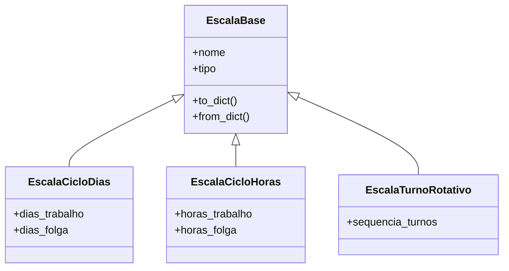
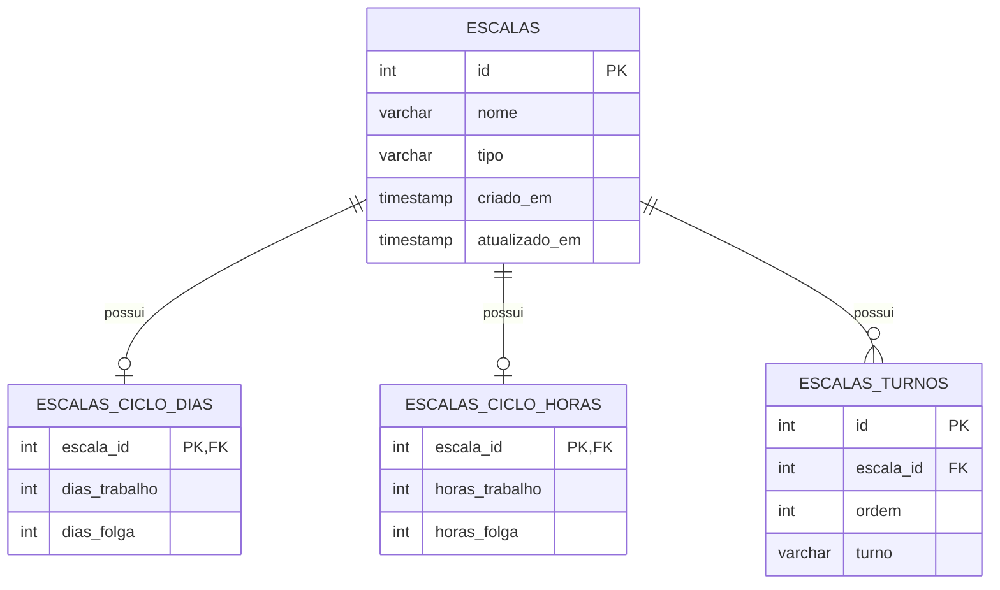
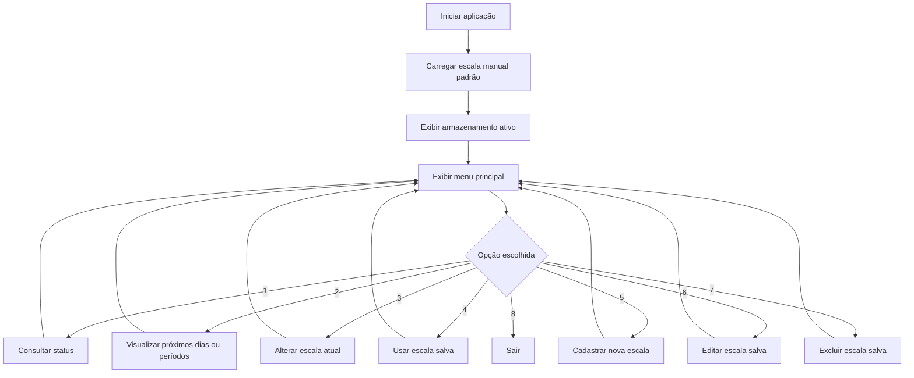
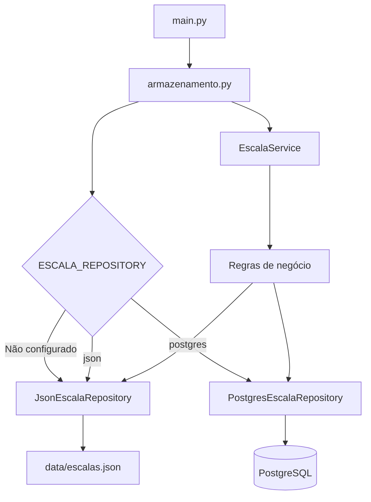
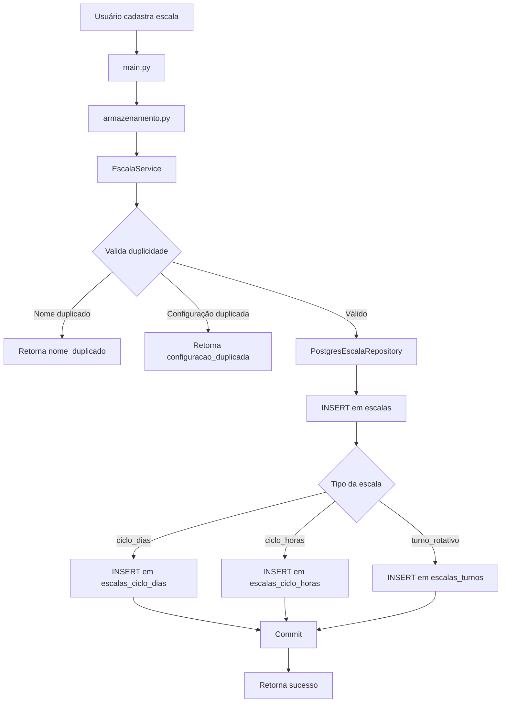

<p align="center">
  
</p>

<h1 align="center">⏰ Simulador de Escala de Trabalho</h1>

<p align="center">
  <strong>Aplicação em Python para consultar, simular, cadastrar, editar, reutilizar e excluir escalas de trabalho por dias, por horas e por turnos rotativos, com modelos predefinidos, persistência em JSON e PostgreSQL, testes automatizados e arquitetura em camadas.</strong>
</p>

<p align="center">
  
</p>

<p align="center">
  
  
  
  
  
  
  
  
</p>

<p align="center">
  <a href="https://dinox75.github.io/simulador-escala-trabalho/demo/" target="_blank">
    
  </a>
</p>

<p align="center">
  <a href="#-sobre-o-projeto">Sobre</a> •
  <a href="#-versão-atual">Versão atual</a> •
  <a href="#-funcionalidades">Funcionalidades</a> •
  <a href="#-arquitetura-da-v090">Arquitetura</a> •
  <a href="#-persistência-json-e-postgresql">Persistência</a> •
  <a href="#-fluxogramas">Fluxogramas</a> •
  <a href="#-testes-automatizados">Testes</a> •
  <a href="#-como-executar-o-projeto">Executar</a> •
  <a href="#-roadmap">Roadmap</a>
</p>

---

<table>
  <tr>
    <td width="25%" align="center">
      <h3>📆 Escalas por dias</h3>
      <p>Modelos como 6x3, 5x2 e 4x2.</p>
    </td>
    <td width="25%" align="center">
      <h3>⏱️ Escalas por horas</h3>
      <p>Suporte para ciclos como 12x36.</p>
    </td>
    <td width="25%" align="center">
      <h3>🔄 Turno rotativo</h3>
      <p>Sequências manuais, por blocos e modelos prontos.</p>
    </td>
    <td width="25%" align="center">
      <h3>🐘 PostgreSQL</h3>
      <p>Persistência real em banco relacional na v0.9.0.</p>
    </td>
  </tr>
</table>

---

## 📌 Sobre o projeto

O **Simulador de Escala de Trabalho** é uma aplicação em Python criada para consultar, simular e gerenciar escalas de trabalho de forma simples, prática e evolutiva.

A aplicação começou como um simulador de escala `6x3`, mas evoluiu para uma base mais completa, com suporte a:

* escalas por dias;
* escalas por horas;
* turnos rotativos;
* montagem de turnos por blocos;
* modelos predefinidos;
* escala real de 24 dias;
* cadastro, edição, exclusão e aplicação de escalas salvas;
* persistência em arquivo JSON;
* persistência em PostgreSQL;
* testes automatizados;
* arquitetura com Programação Orientada a Objetos;
* camada de service;
* camada de repository;
* configuração técnica de armazenamento por variável de ambiente;
* demo web interativa para apresentação do projeto.

O foco do projeto é transformar uma necessidade real de consulta de escala em uma solução técnica organizada, testável e com potencial de evolução para produto.

---

## 🚀 Versão atual

**Versão:** `v0.9.0`

A `v0.9.0` marca a entrada oficial do PostgreSQL no projeto.

Antes, o sistema salvava as escalas apenas em arquivo JSON. Agora, a aplicação também consegue salvar, listar, buscar, editar e excluir escalas em banco de dados PostgreSQL, mantendo o JSON como padrão seguro para execução simples e testes.

### Resumo da v0.9.0

| Área | Evolução |
|---|---|
| Persistência | JSON e PostgreSQL |
| Banco de dados | Schema PostgreSQL funcional |
| Repository | Novo `PostgresEscalaRepository` |
| Configuração | Uso de `ESCALA_REPOSITORY` para alternar tecnicamente entre JSON e PostgreSQL |
| Segurança | Senha do banco via variável de ambiente |
| Testes | Testes automatizados para PostgreSQL e seleção de repository |
| Aplicação real | `main.py` consegue executar usando PostgreSQL |
| Compatibilidade | JSON continua sendo o padrão quando nada é configurado |

---

## ✅ Principais entregas da v0.9.0

* Adicionado suporte real a PostgreSQL.
* Criado arquivo de configuração do banco.
* Criada função de conexão com PostgreSQL.
* Criado inicializador de schema PostgreSQL.
* Implementado `PostgresEscalaRepository`.
* Mantido `JsonEscalaRepository` como opção padrão.
* Adicionada escolha técnica de armazenamento via variável de ambiente.
* Atualizado `armazenamento.py` para usar JSON ou PostgreSQL conforme configuração.
* Atualizado `main.py` para exibir o armazenamento ativo.
* Criados testes automatizados para o repository PostgreSQL.
* Criados testes para a seleção de armazenamento.
* Protegida a senha do banco usando variáveis de ambiente.
* Mantida compatibilidade com os testes e fluxos anteriores.

---

## 📊 Gráfico de evolução

```text
v0.1.0  ─ Simulador inicial 6x3
v0.2.0  ─ Cadastro e persistência básica
v0.3.0  ─ Melhorias de menu e validações
v0.4.0  ─ Modelos predefinidos
v0.5.0  ─ Turnos rotativos
v0.6.0  ─ Demo web
v0.7.0  ─ Melhorias de interface e documentação
v0.8.0  ─ POO + Service + Repository
v0.9.0  ─ PostgreSQL funcional
v0.10.0 ─ Site profissional e documentação separada
v1.0.0  ─ Sistema oficial com login, cadastro e perfis
```

---

## 📌 Problema resolvido

Muitas escalas de trabalho não seguem um padrão simples de segunda a sexta.

Em ambientes reais, é comum encontrar escalas como:

* `6x3`;
* `5x2`;
* `4x2`;
* `12x36`;
* ciclos por turnos;
* sequências alternadas de manhã, tarde, noite e folga;
* escalas longas com vários dias de repetição.

Controlar isso manualmente pode gerar confusão, principalmente quando a pessoa precisa consultar rapidamente se estará trabalhando ou de folga em uma data específica.

---

## ✅ Solução proposta

O projeto permite que o usuário:

* escolha uma escala pronta;
* crie uma escala personalizada;
* consulte o status em uma data;
* visualize os próximos dias ou períodos;
* cadastre escalas;
* edite escalas salvas;
* exclua escalas salvas;
* alterne tecnicamente entre persistência JSON e PostgreSQL;
* mantenha os dados organizados em uma arquitetura evolutiva.

---

## 🎯 Funcionalidades

### Consulta de status

Permite informar uma data e descobrir se ela representa:

* dia de trabalho;
* dia de folga;
* turno específico;
* período de trabalho;
* período de descanso.

### Visualização de próximos dias ou períodos

Permite gerar uma previsão futura da escala, facilitando planejamento de rotina, trabalho, descanso e compromissos.

### Cadastro de escalas

O usuário pode cadastrar:

* escalas por dias;
* escalas por horas;
* turnos rotativos.

### Edição de escalas

Permite alterar nome e configuração de uma escala salva.

### Exclusão de escalas

Permite remover escalas salvas da persistência ativa.

### Modelos predefinidos

O sistema possui modelos prontos para facilitar o uso inicial.

### Persistência

Na v0.9.0, o projeto suporta dois mecanismos:

* JSON;
* PostgreSQL.

O JSON continua útil para testes, execução simples e demonstrações locais.

O PostgreSQL passa a representar o caminho mais profissional para evolução do projeto.

---

## 🧩 Modelos predefinidos

### Modelos disponíveis

* Escala 6x3;
* Escala 5x2;
* Escala 4x2;
* Escala 12x36;
* Turno rotativo;
* Escala real de 24 dias.

### Escala real de 24 dias

O projeto também possui uma escala real mais longa, representando uma situação mais próxima do uso prático.

---

## 🧠 Como a lógica funciona

### 🔁 Escalas por dias

Exemplo: `6x3`

```text
6 dias trabalhando
3 dias de folga
Ciclo total: 9 dias
```

O sistema calcula a diferença entre a data inicial e a data consultada, aplica o módulo do ciclo e identifica se a posição pertence ao período de trabalho ou folga.

### ⏱️ Escalas por horas

Exemplo: `12x36`

```text
12 horas trabalhando
36 horas de folga
Ciclo total: 48 horas
```

Nesse caso, o cálculo considera data e hora, não apenas o dia.

### 🔄 Turno rotativo

Exemplo:

```text
Manhã -> Manhã -> Tarde -> Tarde -> Noite -> Noite -> Folga -> Folga
```

O sistema usa a posição dentro da sequência para descobrir o turno correspondente à data consultada.

### 🧱 Montagem por blocos

Além de digitar a sequência manualmente, o usuário pode montar blocos como:

```text
Manhã x2
Tarde x2
Noite x2
Folga x2
```

Resultado:

```text
Manhã -> Manhã -> Tarde -> Tarde -> Noite -> Noite -> Folga -> Folga
```

---

## 🖥️ Menu principal da CLI

A aplicação roda no terminal e apresenta um menu semelhante a:

```text
1 - Consultar status em uma data
2 - Visualizar próximos dias/períodos
3 - Alterar escala atual
4 - Usar escala salva
5 - Cadastrar nova escala
6 - Editar escala salva
7 - Excluir escala salva
8 - Sair
```

Na v0.9.0, a aplicação também exibe o armazenamento técnico ativo:

```text
Armazenamento ativo: JSON
```

ou:

```text
Armazenamento ativo: PostgreSQL
```

---

## 🧱 Arquitetura da v0.9.0

A arquitetura foi organizada para separar responsabilidades.

```text
main.py
  │
  ▼
interface.py / validacoes.py
  │
  ▼
armazenamento.py
  │
  ▼
EscalaService
  │
  ▼
EscalaRepository
  │
  ├── JsonEscalaRepository
  │
  └── PostgresEscalaRepository
  │
  ▼
JSON ou PostgreSQL
```

---

## 🧩 Arquitetura em camadas

### Ideia principal

O projeto separa:

* entrada do usuário;
* validação;
* regra de negócio;
* persistência;
* modelos de domínio;
* infraestrutura de banco.

Isso evita que a aplicação fique presa a um único formato de armazenamento.

---

## 🧠 Responsabilidade das camadas

| Camada | Responsabilidade |
|---|---|
| `main.py` | Controla o fluxo principal da CLI |
| `interface.py` | Exibe menus, listas e resultados |
| `validacoes.py` | Lê e valida entradas do usuário |
| `escala.py` | Calcula status e próximos dias/períodos |
| `armazenamento.py` | Faz a ponte entre a aplicação e o service |
| `services/escala_service.py` | Regras de cadastro, edição, exclusão e duplicidade |
| `repositories/escala_repository.py` | Contrato dos repositories |
| `repositories/json_escala_repository.py` | Persistência em JSON |
| `repositories/postgres_escala_repository.py` | Persistência em PostgreSQL |
| `models/` | Classes de domínio das escalas |
| `database/` | Conexão, schema e inicialização do PostgreSQL |
| `config/` | Configurações via variáveis de ambiente |

---

## 🏛️ Diagrama das classes POO



---

## 🧱 Estrutura atual do projeto

```text
simulador-escala-trabalho/
├── assets/
│   └── banner.png
│
├── config/
│   ├── __init__.py
│   └── database_config.py
│
├── data/
│   └── escalas.json
│
├── database/
│   ├── inicializar_postgres.py
│   ├── postgres_connection.py
│   └── schema_postgresql.sql
│
├── docs/
│   └── demo/
│       ├── index.html
│       ├── script.js
│       └── style.css
│
├── models/
│   ├── __init__.py
│   ├── escala_base.py
│   ├── escala_ciclo_dias.py
│   ├── escala_ciclo_horas.py
│   ├── escala_factory.py
│   └── escala_turno_rotativo.py
│
├── repositories/
│   ├── escala_repository.py
│   ├── json_escala_repository.py
│   └── postgres_escala_repository.py
│
├── services/
│   ├── escala_service.py
│   └── escala_service_factory.py
│
├── tests/
│   ├── test_armazenamento_repository.py
│   ├── test_postgres_escala_repository.py
│   └── demais testes do projeto
│
├── armazenamento.py
├── escala.py
├── interface.py
├── main.py
├── modelos_escala.py
├── tipos_escala.py
├── validacoes.py
├── requirements.txt
└── README.md
```

---

## 💾 Persistência JSON e PostgreSQL

Na v0.9.0, a aplicação pode usar dois tipos de persistência.

### JSON

É o padrão quando nenhuma configuração adicional é definida.

```text
ESCALA_REPOSITORY não configurado
ou
ESCALA_REPOSITORY=json
```

Nesse modo, os dados são salvos em:

```text
data/escalas.json
```

### PostgreSQL

É ativado por variável de ambiente:

```text
ESCALA_REPOSITORY=postgres
```

Nesse modo, a aplicação usa o banco PostgreSQL configurado pelas variáveis:

```text
POSTGRES_HOST
POSTGRES_PORT
POSTGRES_DB
POSTGRES_USER
POSTGRES_PASSWORD
```

---

## 💾 Schema atual em JSON

### Formato geral

```json
[
    {
        "nome": "Escala 6x3",
        "tipo": "ciclo_dias",
        "dias_trabalho": 6,
        "dias_folga": 3
    }
]
```

### Exemplo de escala por dias

```json
{
    "nome": "Escala 6x3",
    "tipo": "ciclo_dias",
    "dias_trabalho": 6,
    "dias_folga": 3
}
```

### Exemplo de escala por horas

```json
{
    "nome": "Escala 12x36",
    "tipo": "ciclo_horas",
    "horas_trabalho": 12,
    "horas_folga": 36
}
```

### Exemplo de turno rotativo

```json
{
    "nome": "Turno rotativo padrão",
    "tipo": "turno_rotativo",
    "sequencia_turnos": [
        "Manhã",
        "Tarde",
        "Noite",
        "Folga"
    ]
}
```

---

## 🐘 Schema PostgreSQL

Na v0.9.0, o schema PostgreSQL deixou de ser apenas planejado e passou a ser executável pelo projeto.

### Tabelas principais

```text
escalas
escalas_ciclo_dias
escalas_ciclo_horas
escalas_turnos
```

### Visão geral



### Tabela `escalas`

Armazena os dados principais de toda escala.

```text
id
nome
tipo
criado_em
atualizado_em
```

### Tabela `escalas_ciclo_dias`

Armazena os dados específicos de escalas por dias.

```text
escala_id
dias_trabalho
dias_folga
```

### Tabela `escalas_ciclo_horas`

Armazena os dados específicos de escalas por horas.

```text
escala_id
horas_trabalho
horas_folga
```

### Tabela `escalas_turnos`

Armazena a sequência de turnos das escalas rotativas.

```text
id
escala_id
ordem
turno
```

---

## 🧭 Fluxogramas

### Fluxo de uso da aplicação



### Fluxo interno de persistência



### Fluxo de cadastro no PostgreSQL



---

## 🌐 Demo interativa

O projeto possui uma demo web em:

```text
docs/demo/
```

A demo serve para apresentação visual do projeto no GitHub Pages.

A versão CLI continua sendo a aplicação principal, onde estão as regras mais completas do sistema.

Acesse:

```text
https://dinox75.github.io/simulador-escala-trabalho/demo/
```

---

## 🧪 Testes automatizados

O projeto utiliza `pytest`.

A v0.9.0 inclui testes para:

* regras de cálculo;
* validações;
* armazenamento;
* modelos;
* services;
* repositories;
* JSON;
* PostgreSQL;
* seleção técnica de armazenamento.

### Rodar todos os testes

```bash
pytest
```

### Rodar testes do PostgreSQL

```bash
python -m pytest tests/test_postgres_escala_repository.py
```

### Rodar testes da seleção de armazenamento

```bash
python -m pytest tests/test_armazenamento_repository.py
```

### Observação sobre PostgreSQL nos testes

Os testes do PostgreSQL foram preparados para serem seguros.

Se o PostgreSQL estiver disponível e configurado, eles rodam.

Se o PostgreSQL não estiver disponível, podem ser ignorados sem quebrar o restante do projeto.

---

## ⚙️ GitHub Actions

O projeto pode ser validado automaticamente com GitHub Actions usando os testes do `pytest`.

A execução padrão pode validar o fluxo em JSON, sem exigir PostgreSQL local no ambiente de CI.

---

## ▶️ Como executar o projeto

### 1. Clonar o repositório

```bash
git clone https://github.com/Dinox75/simulador-escala-trabalho.git
```

### 2. Entrar na pasta

```bash
cd simulador-escala-trabalho
```

### 3. Criar ambiente virtual

```bash
python -m venv venv
```

### 4. Ativar ambiente virtual

No Windows:

```bash
venv\Scripts\activate
```

No Linux/Mac:

```bash
source venv/bin/activate
```

### 5. Instalar dependências

```bash
pip install -r requirements.txt
```

### 6. Executar aplicação com JSON

JSON é o modo padrão.

```bash
python main.py
```

Também é possível forçar explicitamente:

No PowerShell:

```powershell
$env:ESCALA_REPOSITORY="json"
python main.py
```

### 7. Executar aplicação com PostgreSQL

Antes, configure as variáveis de ambiente.

No PowerShell:

```powershell
$env:POSTGRES_USER="postgres"
$env:POSTGRES_PASSWORD="SUA_SENHA_AQUI"
$env:POSTGRES_DB="simulador_escala"
$env:POSTGRES_HOST="127.0.0.1"
$env:POSTGRES_PORT="5432"
$env:ESCALA_REPOSITORY="postgres"
```

Depois execute:

```powershell
python main.py
```

A aplicação deve exibir:

```text
Armazenamento ativo: PostgreSQL
```

### 8. Executar testes

```bash
pytest
```

---

## 🐘 Como preparar o PostgreSQL

### 1. Instalar PostgreSQL

Instale o PostgreSQL localmente e garanta que o `psql` esteja disponível no terminal.

### 2. Entrar no PostgreSQL

```powershell
psql -U postgres -h 127.0.0.1 -p 5432 -d postgres
```

### 3. Criar o banco

Dentro do `psql`:

```sql
CREATE DATABASE simulador_escala;
```

Sair:

```sql
\q
```

### 4. Configurar variáveis de ambiente

No PowerShell:

```powershell
$env:POSTGRES_USER="postgres"
$env:POSTGRES_PASSWORD="SUA_SENHA_AQUI"
$env:POSTGRES_DB="simulador_escala"
$env:POSTGRES_HOST="127.0.0.1"
$env:POSTGRES_PORT="5432"
```

### 5. Inicializar as tabelas

```powershell
python -m database.inicializar_postgres
```

Resultado esperado:

```text
Banco PostgreSQL inicializado com sucesso.
```

### 6. Conferir tabelas no banco

```powershell
psql -U postgres -h 127.0.0.1 -p 5432 -d simulador_escala
```

Dentro do `psql`:

```sql
\dt
```

Consultar escalas:

```sql
SELECT * FROM escalas;
```

Consultar escalas por dias:

```sql
SELECT * FROM escalas_ciclo_dias;
```

Consultar escalas por horas:

```sql
SELECT * FROM escalas_ciclo_horas;
```

Consultar turnos rotativos:

```sql
SELECT * FROM escalas_turnos ORDER BY escala_id, ordem;
```

Sair:

```sql
\q
```

---

## 💾 Exemplo de escalas salvas

### JSON

```json
[
    {
        "nome": "Escala 6x3",
        "tipo": "ciclo_dias",
        "dias_trabalho": 6,
        "dias_folga": 3
    },
    {
        "nome": "Escala 12x36",
        "tipo": "ciclo_horas",
        "horas_trabalho": 12,
        "horas_folga": 36
    },
    {
        "nome": "Turno rotativo padrão",
        "tipo": "turno_rotativo",
        "sequencia_turnos": [
            "Manhã",
            "Tarde",
            "Noite",
            "Folga"
        ]
    }
]
```

### PostgreSQL

Tabela `escalas`:

```text
id | nome                    | tipo
1  | Escala 6x3              | ciclo_dias
2  | Escala 12x36            | ciclo_horas
3  | Turno rotativo padrão   | turno_rotativo
```

Tabela `escalas_ciclo_dias`:

```text
escala_id | dias_trabalho | dias_folga
1         | 6              | 3
```

Tabela `escalas_ciclo_horas`:

```text
escala_id | horas_trabalho | horas_folga
2         | 12              | 36
```

Tabela `escalas_turnos`:

```text
escala_id | ordem | turno
3         | 1     | Manhã
3         | 2     | Tarde
3         | 3     | Noite
3         | 4     | Folga
```

---

## 🏢 Visão de produto

A v0.9.0 aproxima o projeto de uma aplicação real.

Com PostgreSQL funcionando, o sistema passa a ter uma base mais preparada para recursos como:

* login;
* cadastro de usuários;
* perfis;
* histórico individual;
* área de colaborador;
* área de empresa;
* escalas vinculadas a pessoas;
* consultas por período;
* painel web;
* API.

### 👤 Área do colaborador

Possíveis recursos futuros:

* visualizar escala pessoal;
* consultar folgas futuras;
* receber alertas;
* salvar preferências;
* acompanhar histórico.

### 🏭 Área da empresa

Possíveis recursos futuros:

* cadastrar colaboradores;
* cadastrar múltiplas escalas;
* atribuir escala por funcionário;
* visualizar equipes;
* organizar turnos;
* gerar relatórios.

---

## 🗺️ Roadmap

### Próximas versões

```text
v0.10.0
- Site profissional
- Documentação separada
- Melhor apresentação da demo
- Melhor organização visual do projeto

v1.0.0
- Sistema oficial com login
- Cadastro de usuários
- Perfis
- Associação de escalas a usuários
- Base mais próxima de produto real
```

### Melhorias técnicas planejadas

* Criar camada de API.
* Criar interface web com backend.
* Melhorar tratamento de erros de banco.
* Adicionar migrations versionadas.
* Separar presets de escalas dos modelos de domínio.
* Criar seeds para dados iniciais.
* Criar testes de integração mais completos.
* Melhorar suporte a ambiente de produção.

### Melhorias de produto planejadas

* Cadastro de colaborador.
* Cadastro de empresa.
* Login.
* Painel individual.
* Painel administrativo.
* Relatórios.
* Calendário visual.
* Exportação de escala.
* Notificações.

---

## 🧭 Linha de evolução técnica

```text
Funções simples
   ↓
Separação em arquivos
   ↓
Validações
   ↓
Persistência JSON
   ↓
Modelos predefinidos
   ↓
Turno rotativo
   ↓
Demo web
   ↓
POO
   ↓
Service
   ↓
Repository
   ↓
PostgreSQL
   ↓
Futura API
   ↓
Futuro sistema com login
```

---

## 🧠 Aprendizados aplicados

Este projeto aplica conceitos importantes de desenvolvimento de software:

* funções;
* estruturas condicionais;
* loops;
* listas;
* dicionários;
* manipulação de datas;
* validação de entrada;
* arquivos JSON;
* Programação Orientada a Objetos;
* herança;
* métodos de conversão;
* arquitetura em camadas;
* padrão repository;
* camada service;
* banco de dados PostgreSQL;
* SQL;
* variáveis de ambiente;
* testes automatizados;
* versionamento com Git;
* documentação técnica.

---

## 📚 Tecnologias usadas

* Python;
* Pytest;
* JSON;
* PostgreSQL;
* psycopg2;
* HTML;
* CSS;
* JavaScript;
* Git;
* GitHub;
* GitHub Pages.

---

## 📷 Demonstração visual

A demo web está disponível em:

```text
https://dinox75.github.io/simulador-escala-trabalho/demo/
```

Ela apresenta visualmente o conceito do simulador e serve como apoio para divulgação do projeto.

---

## ⚠️ Limitações atuais

Mesmo com PostgreSQL funcional, a aplicação ainda possui algumas limitações:

* ainda é uma aplicação principal de terminal;
* ainda não possui login;
* ainda não possui cadastro de usuários;
* ainda não possui painel web conectado ao banco;
* ainda não possui API;
* ainda não possui migrations versionadas;
* a escolha de JSON/PostgreSQL é técnica, feita por variável de ambiente;
* a demo web ainda não está conectada ao backend Python;
* ainda não existe vínculo entre escala e usuário específico.

---

## ✅ Status da v0.9.0

A `v0.9.0` está funcional e estável para o objetivo da versão.

Entregas confirmadas:

* JSON funcionando como padrão.
* PostgreSQL funcionando como persistência alternativa.
* Aplicação real salvando no PostgreSQL.
* Aplicação real listando dados do PostgreSQL.
* Aplicação real excluindo dados do PostgreSQL.
* Testes automatizados passando.
* Senha do banco mantida fora do código.
* Arquitetura preparada para evolução.

---

## 📄 Licença

Este projeto está sob licença MIT.

---

## 👨‍💻 Autor

Desenvolvido por **Vinicius Lima**.

GitHub:

```text
https://github.com/Dinox75
```

LinkedIn:

```text
https://www.linkedin.com/in/vinicius-limajr/
```
