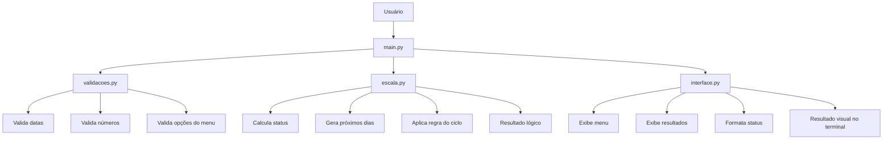
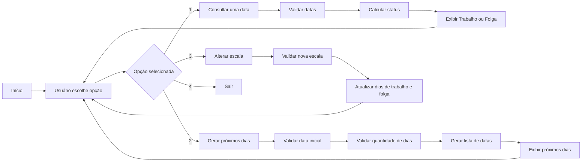
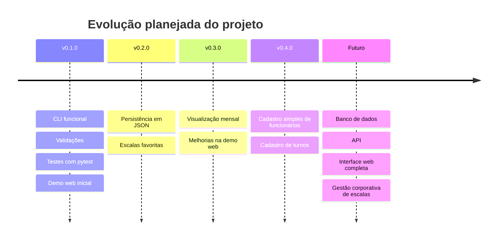

<p align="center">
  
</p>

<h1 align="center">⏰ Simulador de Escala de Trabalho</h1>

<p align="center">
  <strong>Aplicação em Python para consultar, simular e visualizar escalas de trabalho como 6x3, 5x2, 4x4 e outras variações baseadas em ciclos.</strong>
</p>

<p align="center">
  
</p>

<p align="center">
  
  
  
  
  
</p>

<p align="center">
  
  
  
</p>

---

<table>
  <tr>
    <td width="25%" align="center">
      <h3>🔁 Ciclos</h3>
      <p>Calcula a posição de uma data dentro do ciclo da escala.</p>
    </td>
    <td width="25%" align="center">
      <h3>📅 Consulta</h3>
      <p>Informa se uma data será de trabalho ou folga.</p>
    </td>
    <td width="25%" align="center">
      <h3>🧩 Modular</h3>
      <p>Projeto separado por lógica, validação, interface e testes.</p>
    </td>
    <td width="25%" align="center">
      <h3>🌐 Demo</h3>
      <p>Inclui demonstração web interativa em HTML, CSS e JavaScript.</p>
    </td>
  </tr>
</table>

---

## 📌 Versão atual

> **v0.1.0 - Primeira versão CLI funcional**

Esta versão entrega a primeira base funcional do projeto em terminal, com cálculo de escalas, validações, separação de responsabilidades, testes automatizados e documentação profissional.

### Destaques da versão

| Categoria | Entrega |
|---|---|
| 🐍 Aplicação principal | CLI em Python |
| 🔁 Lógica de escala | Cálculo de trabalho e folga por ciclo |
| 🧪 Testes | Testes automatizados com `pytest` |
| 🧩 Arquitetura | Separação entre lógica, validações, interface e fluxo principal |
| 🌐 Demo web | Versão interativa em HTML, CSS e JavaScript |
| 📚 Documentação | README, visão de produto e changelog |
| 📄 Licença | Uso não comercial sem autorização |

---

## 📌 Problema resolvido

Trabalhadores que atuam em escalas como **6x3, 5x2, 4x4 ou outros modelos de ciclo** muitas vezes precisam consultar manualmente se estarão trabalhando ou folgando em uma data futura.

Em ambientes com turnos, revezamentos e escalas diferentes, essa consulta pode gerar:

- dúvidas sobre dias de trabalho;
- confusão em períodos de folga;
- dificuldade para planejar compromissos;
- erros de comunicação;
- dependência de planilhas, murais ou consultas manuais.

Este projeto foi criado para resolver esse problema de forma simples: o usuário informa a data inicial da escala, define o modelo de trabalho e folga, e o sistema calcula automaticamente o status de qualquer data consultada.

---

## ✅ Solução proposta

O **Simulador de Escala de Trabalho** é uma aplicação em **Python** que permite consultar, simular e visualizar escalas de trabalho baseadas em ciclos.

A versão atual funciona via terminal e permite:

- consultar se uma data será de trabalho ou folga;
- visualizar os próximos dias da escala;
- alterar a quantidade de dias trabalhados e dias de folga;
- validar entradas digitadas pelo usuário;
- organizar a lógica em módulos separados;
- testar a regra principal com testes automatizados;
- visualizar uma demonstração web interativa do conceito.

> [!NOTE]
> Apesar de começar como um projeto simples em CLI, ele foi estruturado com visão de produto: lógica clara, organização modular, testes automatizados, documentação profissional e espaço para evolução futura.

---

## 🎯 Objetivo do projeto

Criar uma ferramenta prática para simular escalas de trabalho de forma automática, reduzindo consultas manuais e facilitando o planejamento do usuário.

| Recurso | Descrição |
|---|---|
| 📅 Definir data inicial | Informa quando o ciclo da escala começa |
| 🔎 Consultar uma data | Verifica se o usuário estará trabalhando ou folgando |
| 📆 Visualizar próximos dias | Gera uma sequência futura da escala |
| ⚙️ Alterar escala | Permite mudar os dias de trabalho e folga |
| 🧠 Entender o ciclo | Aplica cálculo modular para localizar a posição dentro da escala |
| 🧪 Validar a lógica | Usa testes automatizados para reduzir erros em futuras alterações |
| 🌐 Experimentar visualmente | Permite testar o conceito em uma demo web simples |

---

## 🧠 Exemplo prático

Imagine a seguinte situação:

| Informação | Valor |
|---|---|
| Data inicial da escala | `01/05/2026` |
| Modelo de escala | `6x3` |
| Data consultada | `07/05/2026` |

Resultado esperado:

```text
Na data 07/05/2026, você estará: 🌙 Folga
```

### Interpretação

Uma escala **6x3** significa:

```text
6 dias trabalhando + 3 dias folgando = ciclo de 9 dias
```

Representação visual do ciclo:

<p align="center">
  
  
  
  
  
  
  
  
  
</p>

---

## ⚙️ Funcionalidades

| Funcionalidade | Status |
|---|---|
| Consultar uma data específica | ✅ Implementado |
| Gerar próximos dias da escala | ✅ Implementado |
| Alterar escala pelo menu | ✅ Implementado |
| Validação de datas | ✅ Implementado |
| Validação de entradas numéricas | ✅ Implementado |
| Validação de opções do menu | ✅ Implementado |
| Interface organizada em módulo próprio | ✅ Implementado |
| Formatação visual de status no terminal | ✅ Implementado |
| Testes automatizados da lógica principal | ✅ Implementado |
| Demo web interativa | ✅ Implementado |
| README profissional | ✅ Implementado |
| Documento de visão futura do produto | ✅ Implementado |
| Licença de uso não comercial | ✅ Implementado |
| Calendário mensal visual | 🔜 Planejado |
| Cadastro de funcionários | 🔜 Planejado |
| Persistência em JSON | 🔜 Planejado |
| Exportação de relatórios | 🔜 Planejado |
| Interface gráfica ou web completa | 🔜 Planejado |

---

## 🖥️ Demonstração no terminal

```text
==========================================
        ⏰ SIMULADOR DE ESCALAS
==========================================
Escala atual: 6x3
------------------------------------------
1 - Consultar uma data
2 - Ver próximos dias
3 - Alterar escala
4 - Sair
==========================================

Escolha uma opção: 1
Digite a data inicial da escala (dd/mm/aaaa): 01/05/2026
Digite a data que deseja consultar (dd/mm/aaaa): 07/05/2026

Na data 07/05/2026, você estará: 🌙 Folga
```

Exemplo de visualização dos próximos dias:

```text
==== PRÓXIMOS DIAS ====
01/05/2026: 🟢 Trabalhando
02/05/2026: 🟢 Trabalhando
03/05/2026: 🟢 Trabalhando
04/05/2026: 🟢 Trabalhando
05/05/2026: 🟢 Trabalhando
06/05/2026: 🟢 Trabalhando
07/05/2026: 🌙 Folga
08/05/2026: 🌙 Folga
09/05/2026: 🌙 Folga
10/05/2026: 🟢 Trabalhando
```

---

## 🌐 Demo interativa

Além da aplicação principal em Python via terminal, o projeto possui uma demonstração web simples em **HTML, CSS e JavaScript**.

A demo permite testar visualmente a lógica da escala diretamente pelo navegador, informando:

- data inicial;
- dias de trabalho;
- dias de folga;
- quantidade de dias para visualizar.

> [!NOTE]
> A demo web não substitui a aplicação principal em Python. Ela funciona como uma vitrine interativa para apresentação do conceito.

### Acessar demo

```text
docs/demo/
```

Após ativar o GitHub Pages, a demo poderá ser acessada por um link semelhante a:

```text
https://dinox75.github.io/simulador-escala-trabalho/demo/
```

---

## 🧩 Organograma técnico



---

## 🧱 Arquitetura do projeto

```text
simulador-escala-trabalho/
│
├── assets/
│   └── banner.png
│
├── docs/
│   ├── visao_produto.md
│   └── demo/
│       ├── index.html
│       ├── style.css
│       └── script.js
│
├── tests/
│   └── test_escala.py
│
├── escala.py
├── interface.py
├── main.py
├── validacoes.py
├── pytest.ini
├── requirements.txt
├── LICENSE
├── CHANGELOG.md
└── README.md
```

### Responsabilidade dos arquivos

| Arquivo/Pasta | Responsabilidade |
|---|---|
| `assets/` | Armazena recursos visuais do projeto |
| `banner.png` | Banner principal utilizado no README |
| `docs/` | Documentação complementar e visão futura do produto |
| `docs/demo/` | Demo web interativa |
| `visao_produto.md` | Documento estratégico sobre evolução do projeto |
| `tests/` | Testes automatizados do projeto |
| `test_escala.py` | Testes da lógica principal de escala |
| `escala.py` | Contém a lógica de cálculo da escala |
| `interface.py` | Centraliza menus, mensagens e exibição no terminal |
| `validacoes.py` | Centraliza validações de entrada do usuário |
| `main.py` | Controla o fluxo principal da aplicação |
| `pytest.ini` | Configuração para execução dos testes |
| `requirements.txt` | Lista dependências do projeto |
| `LICENSE` | Licença proprietária de uso não comercial |
| `CHANGELOG.md` | Histórico de alterações do projeto |
| `README.md` | Documentação principal do projeto |

---

## 🔄 Fluxo de funcionamento



---

## 🧮 Como funciona a lógica

A lógica principal usa o conceito de **ciclo**.

Em uma escala `6x3`:

```text
ciclo = dias de trabalho + dias de folga
ciclo = 6 + 3
ciclo = 9 dias
```

Depois, o sistema calcula a diferença entre a data consultada e a data inicial da escala:

```text
dias_passados = data_consulta - data_inicio
posicao_ciclo = dias_passados % ciclo
```

A decisão acontece assim:

```text
Se posicao_ciclo < dias_trabalho:
    Trabalhando
Senão:
    Folga
```

Essa abordagem permite reaproveitar a mesma lógica para diferentes modelos de escala, como:

- `6x3`
- `5x2`
- `4x4`
- modelos personalizados definidos pelo usuário.

> [!WARNING]
> Escalas baseadas em horas, como `12x36`, exigem uma lógica diferente da atual, pois envolvem controle por horário e não apenas por dias completos.

---

## 🛠️ Tecnologias utilizadas

<p align="center">
  
  
  
  
  
  
  
  
  
</p>

### Conceitos praticados

- lógica de programação;
- funções;
- modularização;
- manipulação de datas;
- estruturas condicionais;
- estruturas de repetição;
- validação de entrada;
- cálculo de ciclos;
- testes automatizados;
- organização de projeto;
- documentação para portfólio;
- visão de evolução de produto;
- criação de demo web estática.

---

## 🚀 Como executar

### 1. Clone o repositório

```bash
git clone https://github.com/Dinox75/simulador-escala-trabalho.git
```

### 2. Acesse a pasta do projeto

```bash
cd simulador-escala-trabalho
```

### 3. Instale as dependências

```bash
pip install -r requirements.txt
```

### 4. Execute o projeto

```bash
python main.py
```

Ou, dependendo do ambiente:

```bash
python3 main.py
```

---

## 🧪 Testes automatizados

O projeto possui testes com `pytest` para validar a lógica principal da escala.

### Executar os testes

```bash
python -m pytest
```

Exemplo de saída esperada:

```text
collected 3 items

tests/test_escala.py ...
```

### O que está sendo testado

| Função | O que o teste valida |
|---|---|
| `calcular_status()` | Se uma data retorna corretamente `Trabalhando` ou `Folga` |
| `gerar_proximos_dias()` | Se a sequência gerada respeita o ciclo da escala |
| Escala `6x3` | Se os primeiros 6 dias são trabalho e os 3 seguintes são folga |

---

## 🧪 Testes manuais sugeridos

| Data inicial | Escala | Data consultada | Resultado esperado |
|---|---|---|---|
| `01/05/2026` | `6x3` | `01/05/2026` | Trabalhando |
| `01/05/2026` | `6x3` | `06/05/2026` | Trabalhando |
| `01/05/2026` | `6x3` | `07/05/2026` | Folga |
| `01/05/2026` | `6x3` | `09/05/2026` | Folga |
| `01/05/2026` | `6x3` | `10/05/2026` | Trabalhando |

---

## 🧭 Roadmap



### Versão atual

- [x] Criar lógica de cálculo de escala
- [x] Consultar status de uma data
- [x] Gerar próximos dias da escala
- [x] Criar menu interativo
- [x] Permitir alteração da escala no terminal
- [x] Separar validações em módulo próprio
- [x] Separar exibições em módulo próprio
- [x] Adicionar testes automatizados
- [x] Criar documentação de visão do produto
- [x] Adicionar licença de uso não comercial
- [x] Criar demo web inicial

### Próximas melhorias

- [ ] Ativar GitHub Pages para a demo
- [ ] Criar cadastro simples de escalas favoritas
- [ ] Salvar configurações em arquivo JSON
- [ ] Criar visualização mensal da escala
- [ ] Adicionar suporte para múltiplos funcionários
- [ ] Permitir cadastro de turnos
- [ ] Exportar resultados em `.txt`, `.csv` ou `.pdf`
- [ ] Criar interface gráfica
- [ ] Criar versão web completa
- [ ] Evoluir para sistema corporativo de gestão de escalas

---

## 💼 Valor profissional

Este projeto demonstra habilidades importantes para desenvolvimento de software:

<table>
  <tr>
    <td align="center">
      <strong>🧠 Lógica</strong><br>
      Cálculo de ciclos e regras
    </td>
    <td align="center">
      <strong>📅 Datas</strong><br>
      Manipulação com datetime
    </td>
    <td align="center">
      <strong>🧩 Modularização</strong><br>
      Separação de responsabilidades
    </td>
  </tr>
  <tr>
    <td align="center">
      <strong>🖥️ CLI</strong><br>
      Interação via terminal
    </td>
    <td align="center">
      <strong>🧪 Testes</strong><br>
      Validação automatizada com pytest
    </td>
    <td align="center">
      <strong>🌐 Demo Web</strong><br>
      Apresentação visual do conceito
    </td>
  </tr>
</table>

> [!IMPORTANT]
> O objetivo não é apenas criar um script, mas desenvolver um projeto apresentável, organizado, testável e com potencial de evolução.

---

## 🏢 Visão futura do produto

Este projeto também possui uma documentação estratégica descrevendo sua possível evolução para uma plataforma corporativa de gestão de escalas.

A ideia futura envolve:

- cadastro de empresas;
- cadastro de funcionários;
- gestão de escalas por colaborador;
- feriados;
- férias;
- paradas programadas;
- relatórios individuais e gerais;
- integração com sistemas de ponto;
- painel para empresa;
- painel para colaborador.

Leia mais em:

```text
docs/visao_produto.md
```

---

## 📝 Changelog

As mudanças do projeto são registradas no arquivo:

```text
CHANGELOG.md
```

---

## 👨‍💻 Autor

**Vinicius Lima**

Estudante de **Análise de Dados e Desenvolvimento de Sistemas**, com foco em desenvolvimento prático, automação, análise de dados e construção de projetos para GitHub e LinkedIn.

### Áreas de interesse

<p>
  
  
  
  
  
  
</p>

---

## 📄 Licença

Este projeto está protegido por uma **Licença Proprietária de Uso Não Comercial**.

O código está disponível publicamente para fins de estudo, avaliação técnica, portfólio e recrutamento.  
O uso comercial, redistribuição, venda, cópia substancial ou criação de soluções derivadas para fins comerciais não é permitido sem autorização prévia e por escrito do autor.

Para mais detalhes, consulte o arquivo [LICENSE](./LICENSE).

---

<p align="center">
  <strong>Projeto desenvolvido como parte da minha jornada de aprendizado, prática e evolução profissional em tecnologia.</strong>
</p>

<p align="center">
  
  
  
</p>

<p align="center">
  
</p>

<p align="center">
  ⭐ Se este projeto te ajudou ou serviu como inspiração, considere deixar uma estrela no repositório.
</p>
