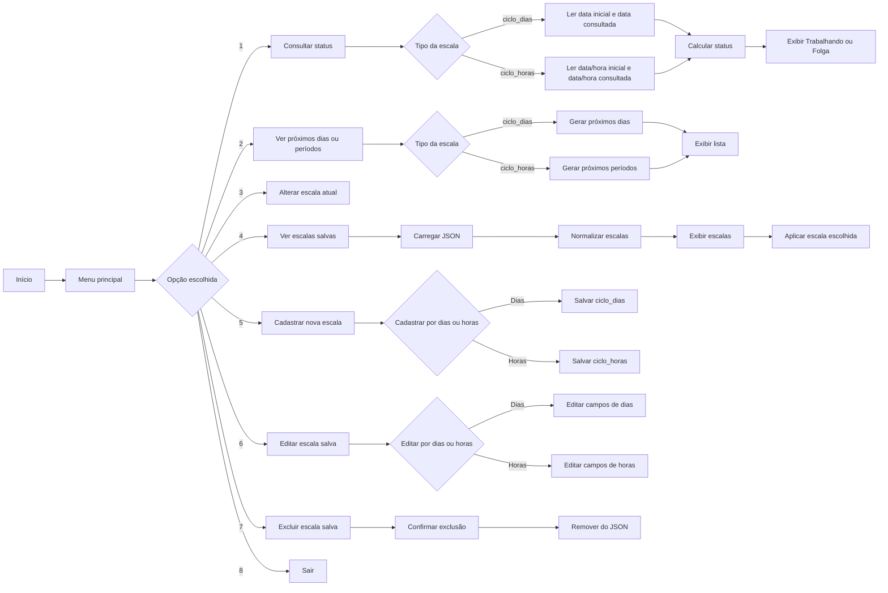
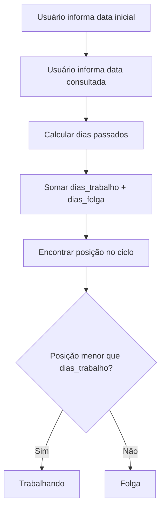
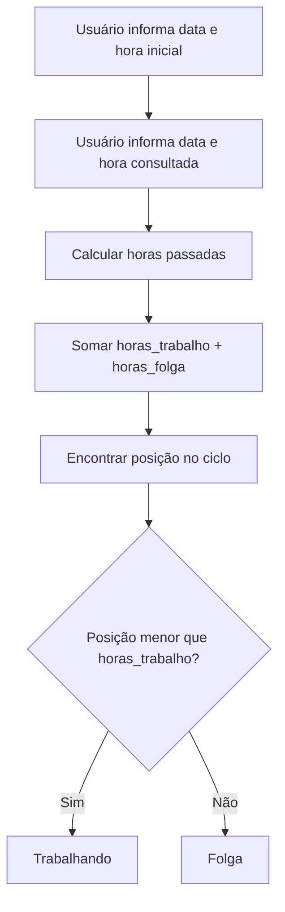
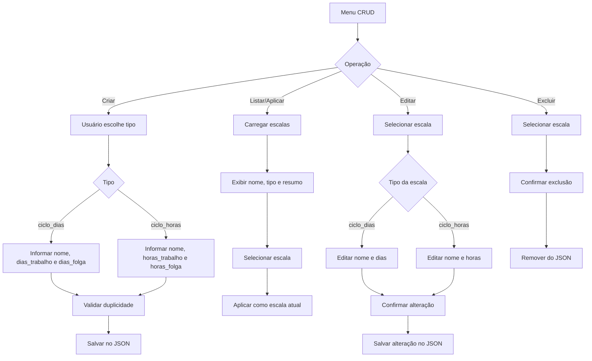
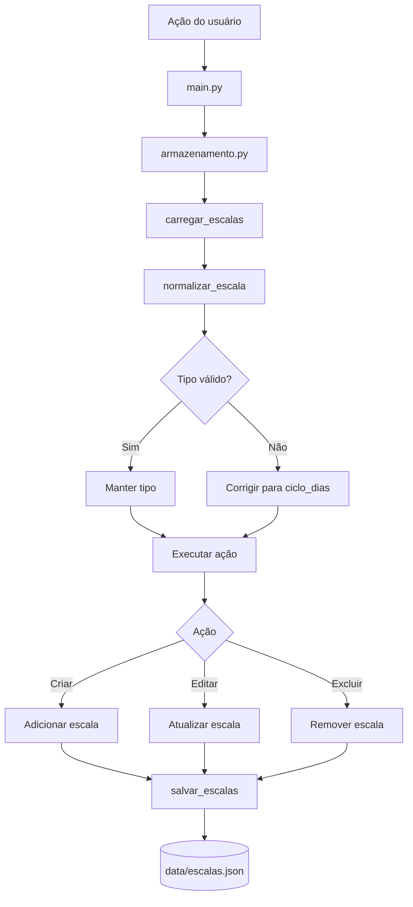

<p align="center">
  
</p>
 
<h1 align="center">⏰ Simulador de Escala de Trabalho</h1>
 
<p align="center">
  <strong>Aplicação em Python para consultar, simular, salvar, reutilizar, editar e excluir escalas de trabalho por dias e por horas, com suporte real para 12x36, CRUD completo, persistência em JSON, testes automatizados e documentação visual com fluxos de funcionamento.</strong>
</p>
 
<p align="center">
  
</p>
 
<p align="center">
  
  
  
  
  
  
  
  
</p>
 
<p align="center">
  
  
  
</p>
 
<p align="center">
  <a href="https://dinox75.github.io/simulador-escala-trabalho/demo/" target="_blank">
    
  </a>
</p>
 
---
 
<table>
  <tr>
    <td width="25%" align="center">
      <h3>🔁 Ciclos por dias</h3>
      <p>Consulta escalas como 6x3, 5x2 e 4x4.</p>
    </td>
    <td width="25%" align="center">
      <h3>⏱️ Ciclos por horas</h3>
      <p>Suporte real para 12x36 e variações como 24x72.</p>
    </td>
    <td width="25%" align="center">
      <h3>⭐ CRUD completo</h3>
      <p>Cria, lista, aplica, edita e exclui escalas salvas.</p>
    </td>
    <td width="25%" align="center">
      <h3>🧪 Testes</h3>
      <p>Projeto validado com testes automatizados usando pytest.</p>
    </td>
  </tr>
</table>
 
---
 
## 📌 Sobre o projeto
 
O **Simulador de Escala de Trabalho** é um projeto em Python criado para consultar, simular e gerenciar escalas de trabalho de forma simples e prática.
 
A aplicação começou como um simulador de escala `6x3`, mas evoluiu para uma estrutura mais completa, com suporte a diferentes tipos de escala, persistência em JSON, CRUD de escalas salvas, testes automatizados, documentação técnica e uma demo web para apresentação visual do projeto.
 
Na versão atual, o sistema trabalha com:
 
- escalas por dias, como `6x3`, `5x2` e `4x4`;
- escalas por horas, como `12x36` e variações como `24x72`;
- cadastro, listagem, aplicação, edição e exclusão de escalas salvas;
- consulta de status de trabalho ou folga;
- geração de próximos dias ou próximos períodos;
- armazenamento em arquivo JSON;
- validações de entrada;
- normalização e migração de escalas antigas;
- testes automatizados com `pytest`;
- documentação visual com fluxogramas e organogramas técnicos.
 
---
 
## 🚀 Versão atual
 
> **v0.5.0 - Escalas por horas, suporte real ao 12x36 e CRUD completo por tipo**
 
A versão `v0.5.0` marca uma evolução importante no projeto: o simulador deixou de trabalhar apenas com ciclos baseados em dias e passou a suportar também ciclos baseados em horas.
 
Com isso, a aplicação agora consegue calcular escalas como `12x36`, considerando data e hora de início, data e hora de consulta e geração de períodos de trabalho e folga.
 
### Principais entregas da v0.5.0
 
| Categoria | Entrega |
|---|---|
| ⏱️ Ciclo por horas | Implementação real do tipo `ciclo_horas` |
| 🕕 Escala 12x36 | Consulta de status usando horas trabalhadas e horas de folga |
| 📆 Próximos períodos | Geração de blocos de trabalho e folga com início e fim |
| 🧾 Data e hora | Entrada no formato `dd/mm/aaaa hh:mm` |
| ⭐ CRUD completo | Cadastro, listagem, aplicação, edição e exclusão de escalas por dias e por horas |
| 💾 Persistência | Escalas salvas em `data/escalas.json` |
| 🧩 Tipos de escala | Suporte real para `ciclo_dias` e `ciclo_horas` |
| 🔄 Compatibilidade | Migração de escalas antigas sem campo `tipo` |
| 🧪 Testes | Novos testes para cálculo, períodos, tipos e armazenamento |
| 🖥️ CLI | Fluxo principal adaptado para trabalhar com dias e horas |
| 📚 Documentação | README reforçado com fluxogramas, organogramas e visão de arquitetura |
 
> [!NOTE]
> A demo web funciona como vitrine visual do projeto. A implementação mais completa da v0.5.0 está na aplicação Python executada pelo terminal.
 
---
 
## 🌐 Demo interativa
 
A demo web apresenta uma versão visual do projeto, com interface moderna, simulação de escalas, gerenciamento visual e documentação dentro da própria página.
 
<p align="center">
  <a href="https://dinox75.github.io/simulador-escala-trabalho/demo/" target="_blank">
    
  </a>
</p>
 
```text
https://dinox75.github.io/simulador-escala-trabalho/demo/
```
 
> [!IMPORTANT]
> A aplicação principal é a CLI em Python. A demo web pode não refletir imediatamente todos os recursos mais recentes da versão `v0.5.0`.
 
---
 
## 📌 Problema resolvido
 
Trabalhadores que atuam em escalas como `6x3`, `5x2`, `4x4`, `12x36` ou outros modelos de ciclo muitas vezes precisam consultar manualmente se estarão trabalhando ou folgando em uma data futura.
 
Em ambientes com turnos, revezamentos e escalas diferentes, isso pode gerar:
 
- dúvidas sobre dias ou horários de trabalho;
- dificuldade para planejar compromissos;
- confusão em períodos de folga;
- erros em consultas manuais;
- dependência de planilhas, murais ou anotações;
- dificuldade para reutilizar escalas já conhecidas;
- dificuldade para editar ou remover escalas cadastradas incorretamente;
- dificuldade para lidar com diferentes modelos de escala em um mesmo sistema.
 
Este projeto nasceu a partir de uma necessidade real: transformar uma regra repetitiva em uma ferramenta prática, testável e expansível.
 
---
 
## ✅ Solução proposta
 
O projeto permite consultar e gerenciar escalas de trabalho de forma automatizada.
 
A versão atual permite:
 
- consultar se uma data será de trabalho ou folga em escalas por dias;
- consultar se uma data e hora estará dentro de trabalho ou folga em escalas por horas;
- visualizar próximos dias para escalas como `6x3`;
- visualizar próximos períodos para escalas como `12x36`;
- alterar a escala atual durante a execução;
- cadastrar escalas por dias;
- cadastrar escalas por horas;
- listar escalas salvas;
- aplicar uma escala salva como escala atual;
- editar escalas salvas por dias;
- editar escalas salvas por horas;
- excluir escalas salvas;
- confirmar ações sensíveis antes de editar ou excluir;
- bloquear nomes duplicados;
- bloquear configurações duplicadas considerando o tipo da escala;
- persistir dados em JSON;
- normalizar escalas antigas sem campo `tipo`;
- validar os tipos de escala;
- testar a lógica com testes automatizados.
 
---
 
## 🎯 Funcionalidades
 
| Funcionalidade | Descrição |
|---|---|
| 🔎 Consultar status | Verifica se o usuário estará trabalhando ou folgando |
| 📆 Ver próximos dias | Gera sequência futura para escalas por dias |
| ⏱️ Ver próximos períodos | Gera blocos de trabalho e folga para escalas por horas |
| ⚙️ Alterar escala atual | Permite trocar rapidamente a escala em uso |
| ⭐ Cadastrar escala | Salva escalas por dias ou por horas |
| 📋 Listar escalas salvas | Exibe escalas registradas no JSON |
| ✅ Aplicar escala salva | Define uma escala salva como escala atual |
| ✏️ Editar escala salva | Atualiza nome e configuração da escala |
| 🗑️ Excluir escala salva | Remove escalas cadastradas |
| 🛡️ Confirmação de ação | Evita alterações e exclusões acidentais |
| 💾 Persistência JSON | Mantém escalas salvas fora do código |
| 🧪 Testes automatizados | Reduz risco de regressão |
| 🌐 Demo web | Apresenta o projeto visualmente no navegador |
 
---
 
## 🧠 Como a lógica funciona
 
### Escalas por dias
 
Exemplo de escala `6x3`:
 
```text
6 dias trabalhando + 3 dias de folga = ciclo de 9 dias
```
 
A lógica calcula quantos dias passaram desde a data inicial da escala e encontra a posição da data consultada dentro do ciclo.
 
Exemplo:
 
```text
Data inicial:    01/05/2026
Escala:          6x3
Data consultada: 07/05/2026
```
 
Resultado:
 
```text
Na data 07/05/2026, você estará: Folga
```
 
### Escalas por horas
 
Exemplo de escala `12x36`:
 
```text
12 horas trabalhando + 36 horas de folga = ciclo de 48 horas
```
 
A lógica calcula quantas horas passaram desde a data e hora inicial da escala e encontra a posição da data e hora consultada dentro do ciclo.
 
Exemplo:
 
```text
Data e hora inicial:    01/06/2026 06:00
Escala:                 12x36
Data e hora consultada: 01/06/2026 20:00
```
 
Resultado:
 
```text
Na data e hora 01/06/2026 20:00, você estará: Folga
```
 
Representação do ciclo:
 
```text
01/06/2026 06:00 até 01/06/2026 18:00 -> Trabalhando
01/06/2026 18:00 até 03/06/2026 06:00 -> Folga
03/06/2026 06:00 até 03/06/2026 18:00 -> Trabalhando
03/06/2026 18:00 até 05/06/2026 06:00 -> Folga
```
 
---
 
## 🧩 Tipos de escala
 
A partir da versão `v0.4.0`, o projeto passou a trabalhar com o campo `tipo`.
 
Na versão `v0.5.0`, o tipo `ciclo_horas` recebeu implementação real no CLI.
 
| Tipo técnico | Nome amigável | Status | Exemplo |
|---|---|---|---|
| `ciclo_dias` | Ciclo por dias | ✅ Implementado | `6x3`, `5x2`, `4x4` |
| `ciclo_horas` | Ciclo por horas | ✅ Implementado | `12x36`, `24x72` |
| `turno_rotativo` | Turno rotativo | 🔜 Planejado | Manhã, tarde, noite e folga |
 
### Exemplo de escalas no JSON
 
```json
[
    {
        "nome": "Escala padrão 6x3",
        "tipo": "ciclo_dias",
        "dias_trabalho": 6,
        "dias_folga": 3
    },
    {
        "nome": "Escala 12x36",
        "tipo": "ciclo_horas",
        "horas_trabalho": 12,
        "horas_folga": 36
    }
]
```
 
> [!NOTE]
> Escalas antigas que não possuem o campo `tipo` são normalizadas automaticamente para `ciclo_dias`.
 
---
 
## ⭐ CRUD de escalas salvas
 
O projeto possui CRUD completo para escalas salvas.
 
| Operação | Status | Descrição |
|---|---|---|
| Create | ✅ Implementado | Cadastra escalas por dias e por horas |
| Read | ✅ Implementado | Lista e aplica escalas salvas |
| Update | ✅ Implementado | Edita escalas por dias e por horas |
| Delete | ✅ Implementado | Remove escalas salvas |
 
As escalas são armazenadas no arquivo:
 
```text
data/escalas.json
```
 
Exemplo de uso:
 
```text
5 - Cadastrar nova escala
4 - Ver escalas salvas
6 - Editar escala salva
7 - Excluir escala salva
```
 
---
 
## 🖥️ Menu da aplicação
 
Ao executar o projeto, o usuário acessa um menu no terminal:
 
```text
==== SIMULADOR DE ESCALAS ====
Escala atual: 6x3 dias
 
1 - Consultar status
2 - Ver próximos dias/períodos
3 - Alterar escala
4 - Ver escalas salvas
5 - Cadastrar nova escala
6 - Editar escala salva
7 - Excluir escala salva
8 - Sair
```
 
Se a escala atual for por horas, o menu passa a mostrar algo como:
 
```text
==== SIMULADOR DE ESCALAS ====
Escala atual: 12x36 horas
```
 
---
 
## 🧩 Organograma técnico

```mermaid
flowchart TD
    A[Usuário] --> B[main.py]
 
    B --> C[validacoes.py]
    B --> D[escala.py]
    B --> E[interface.py]
    B --> F[armazenamento.py]
    B --> H[tipos_escala.py]
 
    C --> C1[Valida datas]
    C --> C2[Valida data e hora]
    C --> C3[Valida números]
    C --> C4[Valida opções]
    C --> C5[Valida índice de lista]
    C --> C6[Valida texto obrigatório]
    C --> C7[Confirma ações do usuário]
 
    D --> D1[Calcula status por dias]
    D --> D2[Calcula status por horas]
    D --> D3[Gera próximos dias]
    D --> D4[Gera próximos períodos]
    D --> D5[Motor por tipo de escala]
 
    E --> E1[Exibe menu]
    E --> E2[Exibe resultados]
    E --> E3[Exibe escalas salvas]
    E --> E4[Formata status]
    E --> E5[Exibe tipo amigável]
 
    F --> F1[Carrega escalas]
    F --> F2[Salva escalas]
    F --> F3[Adiciona escala por dias]
    F --> F4[Adiciona escala por horas]
    F --> F5[Edita escala por dias]
    F --> F6[Edita escala por horas]
    F --> F7[Remove escala salva]
    F --> F8[Normaliza escalas antigas]
    F --> G[(data/escalas.json)]
 
    H --> H1[Centraliza tipos suportados]
    H --> H2[Valida tipo de escala]
    H --> H3[Retorna nome amigável]
```
 

 
---
 
## 🔄 Fluxo principal do sistema
 

 
---
 
## 🔁 Fluxo do ciclo por dias
 

 
---
 
## ⏱️ Fluxo do ciclo por horas / 12x36
 

 
---
 
## ⭐ Fluxo do CRUD de escalas
 

 
---
 
## 💾 Fluxo de persistência JSON
 

 
---
 
## 🧱 Arquitetura do projeto
 
```text
simulador-escala-trabalho/
│
├── assets/
│   └── banner.png
│
├── data/
│   └── escalas.json
│
├── docs/
│   ├── visao_produto.md
│   └── demo/
│       ├── index.html
│       ├── style.css
│       └── script.js
│
├── tests/
│   ├── test_escala.py
│   ├── test_armazenamento.py
│   └── test_tipos_escalas.py
│
├── armazenamento.py
├── escala.py
├── interface.py
├── main.py
├── tipos_escala.py
├── validacoes.py
├── pytest.ini
├── requirements.txt
├── LICENSE
├── CHANGELOG.md
└── README.md
```
 
### Responsabilidade dos arquivos
 
| Arquivo/Pasta | Responsabilidade |
|---|---|
| `assets/` | Armazena recursos visuais do projeto |
| `banner.png` | Banner principal utilizado no README |
| `data/` | Armazena dados utilizados pelo sistema |
| `escalas.json` | Guarda as escalas cadastradas |
| `docs/` | Documentação complementar e visão futura do produto |
| `docs/demo/` | Demo web interativa publicada via GitHub Pages |
| `tests/` | Testes automatizados do projeto |
| `test_escala.py` | Testes da lógica de cálculo por dias, horas e motor por tipo |
| `test_armazenamento.py` | Testes de leitura, salvamento, cadastro, edição, remoção e migração |
| `test_tipos_escalas.py` | Testes dos tipos de escala suportados |
| `armazenamento.py` | Manipula o JSON de escalas salvas |
| `escala.py` | Contém a lógica de cálculo das escalas |
| `interface.py` | Centraliza menus e exibições no terminal |
| `main.py` | Controla o fluxo principal da aplicação |
| `tipos_escala.py` | Centraliza tipos suportados e nomes amigáveis |
| `validacoes.py` | Centraliza validações e confirmações |
| `pytest.ini` | Configuração do pytest |
| `requirements.txt` | Dependências do projeto |
| `LICENSE` | Licença proprietária de uso não comercial |
| `CHANGELOG.md` | Histórico de alterações |
| `README.md` | Documentação principal |
 
---
 
## 🧪 Testes automatizados
 
O projeto utiliza `pytest` para validar as principais regras do sistema.
 
Os testes cobrem:
 
- cálculo de status por dias;
- geração de próximos dias;
- cálculo de status por horas;
- geração de próximos períodos;
- motor por tipo de escala;
- validação dos tipos de escala;
- salvamento e carregamento de escalas;
- cadastro de escalas por dias;
- cadastro de escalas por horas;
- edição de escalas por dias;
- edição de escalas por horas;
- remoção de escalas;
- migração de escalas antigas;
- correção de tipo inválido para o tipo padrão.
 
Para executar:
 
```bash
pytest
```
 
Ou:
 
```bash
python -m pytest
```
 
---
 
## ⚙️ Como executar o projeto
 
### 1. Clone o repositório
 
```bash
git clone https://github.com/Dinox75/simulador-escala-trabalho.git
```
 
### 2. Acesse a pasta
 
```bash
cd simulador-escala-trabalho
```
 
### 3. Instale as dependências
 
```bash
pip install -r requirements.txt
```
 
### 4. Execute a aplicação
 
```bash
python main.py
```
 
---
 
## 💡 Exemplos de uso
 
### Consultar escala 6x3
 
```text
Escala atual: 6x3 dias
 
1 - Consultar status
 
Digite a data inicial da escala (dd/mm/aaaa): 01/05/2026
Digite a data que deseja consultar (dd/mm/aaaa): 07/05/2026
 
Na data 07/05/2026, você estará: Folga
```
 
### Consultar escala 12x36
 
```text
Escala atual: 12x36 horas
 
1 - Consultar status
 
Digite a data e hora inicial da escala (dd/mm/aaaa hh:mm): 01/06/2026 06:00
Digite a data e hora que deseja consultar (dd/mm/aaaa hh:mm): 01/06/2026 10:00
 
Na data e hora 01/06/2026 10:00, você estará: Trabalhando
```
 
### Ver próximos períodos da escala 12x36
 
```text
2 - Ver próximos dias/períodos
 
Digite a data e hora inicial da escala (dd/mm/aaaa hh:mm): 01/06/2026 06:00
Quantos períodos deseja visualizar? 4
 
==== PRÓXIMOS PERÍODOS ====
01/06/2026 06:00 até 01/06/2026 18:00: Trabalhando
01/06/2026 18:00 até 03/06/2026 06:00: Folga
03/06/2026 06:00 até 03/06/2026 18:00: Trabalhando
03/06/2026 18:00 até 05/06/2026 06:00: Folga
```
 
---
 
## 🔄 Evolução por versão
 
| Versão | Destaque |
|---|---|
| `v0.1.0` | Estrutura inicial do simulador |
| `v0.2.0` | Consulta de escala por dias |
| `v0.3.0` | Escalas salvas e persistência em JSON |
| `v0.4.0` | Tipos de escala e preparação arquitetural |
| `v0.5.0` | Ciclo por horas, 12x36 e CRUD completo por tipo |
 
---
 
## 🗺️ Roadmap
 
### Implementado
 
- [x] Cálculo de escala por dias
- [x] Consulta de status por data
- [x] Geração de próximos dias
- [x] Persistência em JSON
- [x] Cadastro de escalas salvas
- [x] Listagem de escalas salvas
- [x] Aplicação de escala salva
- [x] Edição de escala salva
- [x] Exclusão de escala salva
- [x] Campo `tipo` nas escalas
- [x] Normalização de escalas antigas
- [x] Tipo `ciclo_dias`
- [x] Tipo `ciclo_horas`
- [x] Cálculo real para escala `12x36`
- [x] Geração de próximos períodos por horas
- [x] CRUD completo para escalas por dias e por horas
- [x] Testes automatizados
- [x] Demo web para apresentação visual
- [x] Fluxogramas e organogramas no README
 
### Próximos passos
 
- [ ] Atualizar a demo web para refletir completamente a v0.5.0
- [ ] Melhorar formatação visual do terminal
- [ ] Criar mais exemplos de escalas por horas
- [ ] Implementar tipo `turno_rotativo`
- [ ] Permitir exportação de relatórios
- [ ] Criar interface gráfica ou web app funcional
- [ ] Adicionar banco de dados em uma versão futura
- [ ] Criar autenticação para uso multiusuário
- [ ] Expandir para cenário empresarial
 
---
 
## 🧠 Aprendizados aplicados
 
Este projeto envolve vários conceitos importantes de programação e desenvolvimento de software:
 
- funções em Python;
- modularização;
- condicionais;
- loops;
- manipulação de datas;
- manipulação de horas;
- uso de `datetime` e `timedelta`;
- persistência com JSON;
- validação de entrada;
- tratamento de erros;
- separação de responsabilidades;
- testes automatizados;
- arquitetura evolutiva;
- versionamento com Git;
- organização para portfólio;
- visão de produto;
- documentação com fluxogramas e organogramas.
 
---
 
## 🛠️ Tecnologias utilizadas
 
| Tecnologia | Uso |
|---|---|
| Python | Linguagem principal |
| JSON | Armazenamento das escalas |
| Pytest | Testes automatizados |
| Git | Versionamento |
| GitHub | Repositório e documentação |
| GitHub Pages | Publicação da demo web |
| HTML, CSS e JavaScript | Demo visual do projeto |
| Mermaid | Fluxogramas e organogramas no README |
 
---
 
## 📊 Status do projeto
 
| Área | Status |
|---|---|
| CLI principal | ✅ Funcional |
| Escalas por dias | ✅ Funcional |
| Escalas por horas | ✅ Funcional |
| Escala 12x36 | ✅ Funcional no CLI |
| CRUD de escalas | ✅ Completo |
| Persistência JSON | ✅ Funcional |
| Testes automatizados | ✅ Funcional |
| Fluxogramas no README | ✅ Reforçado |
| Demo web | ✅ Publicada |
| Demo web com v0.5.0 completa | 🔜 Próxima melhoria |
| Turno rotativo | 🔜 Planejado |
 
---
 
## ⚠️ Limitações atuais
 
O projeto ainda está em desenvolvimento e possui algumas limitações:
 
- a demo web pode não refletir todas as funções da CLI v0.5.0;
- não possui autenticação de usuário;
- não utiliza banco de dados;
- não possui interface gráfica completa;
- não substitui sistemas oficiais de RH, folha de pagamento ou controle de jornada;
- regras trabalhistas específicas não são validadas automaticamente;
- feriados, férias e afastamentos ainda não são considerados;
- turnos rotativos ainda estão planejados para versões futuras.
 
---
 
## 📚 Changelog resumido da v0.5.0
 
### Adicionado
 
- Suporte ao tipo de escala `ciclo_horas`;
- cálculo real de status para escalas por horas;
- suporte inicial real à escala `12x36`;
- geração de próximos períodos para escalas por horas;
- leitura de data e hora no formato `dd/mm/aaaa hh:mm`;
- cadastro de escalas por horas;
- edição de escalas por horas;
- CRUD completo para escalas por dias e por horas;
- novos testes para cálculo, períodos e armazenamento;
- reforço da documentação com fluxogramas e organogramas atualizados.
 
### Alterado
 
- Menu do CLI adaptado para trabalhar com dias e horas;
- exibição de escalas salvas adaptada para mostrar tipo e resumo;
- fluxo principal do CLI preparado para múltiplos tipos de escala;
- armazenamento ajustado para evitar conflito entre escalas por dias e por horas;
- README atualizado da v0.4.0 para a v0.5.0 sem remover os conceitos visuais de arquitetura.
 
### Mantido
 
- Compatibilidade com escalas antigas por dias;
- migração automática de escalas antigas sem campo `tipo`;
- suporte completo ao ciclo por dias;
- persistência em JSON;
- estrutura modular;
- testes automatizados.
 
---
 
## 👨‍💻 Autor
 
Desenvolvido por **Vinicius Lima**.
 
Este projeto faz parte da minha evolução prática em Python, lógica de programação, testes, organização de código, versionamento, documentação técnica e construção de portfólio.
 
<p align="left">
  <a href="https://github.com/Dinox75" target="_blank">
    
  </a>
</p>
 
---
 
## 📄 Licença
 
Este projeto está disponível publicamente para fins de estudo, avaliação técnica, portfólio e recrutamento.
 
O uso comercial, redistribuição, venda, cópia substancial ou criação de soluções derivadas para fins comerciais não é permitido sem autorização prévia e por escrito do autor.
 
Para mais detalhes, consulte o arquivo [LICENSE](./LICENSE).
 
---
 
<p align="center">
  <strong>Projeto desenvolvido como parte da minha jornada de aprendizado, prática e evolução profissional em tecnologia.</strong>
</p>
 
<p align="center">
  <a href="https://dinox75.github.io/simulador-escala-trabalho/demo/" target="_blank">
    
  </a>
  
  
  
</p>
 
<p align="center">
  
</p>
 
<p align="center">
  ⭐ Se este projeto te ajudou ou serviu como inspiração, considere deixar uma estrela no repositório.
</p>
